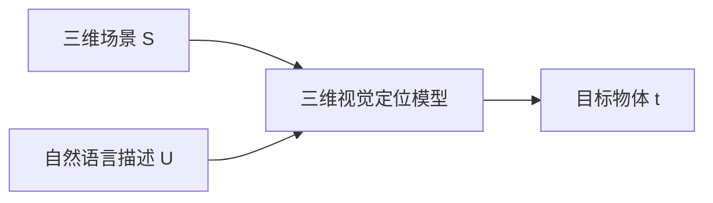
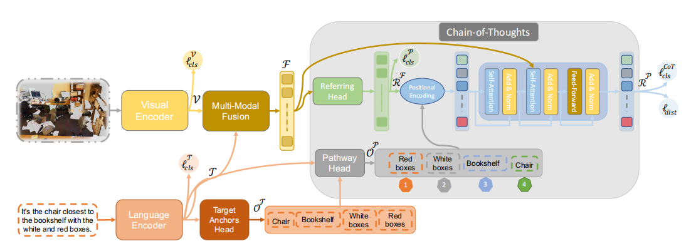
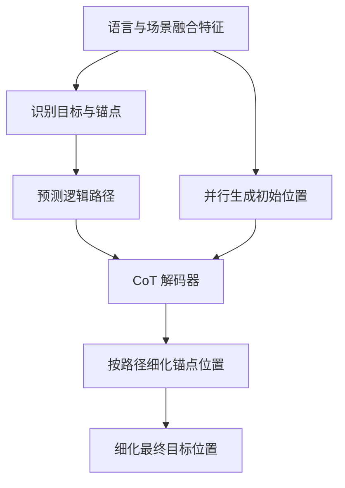

三维视觉定位（3D Visual Grounding）旨在根据自然语言描述，在三维场景中定位描述所指向的具体物体。与一般的物体分类任务不同，该任务不仅要求模型判断目标属于哪一个类别，还要求模型在多个同类别实例中确定正确的空间实体。

例如，给定描述“找出距离放有白色和红色盒子的书架最近的椅子”，目标类别虽然是椅子，但模型还需要识别盒子、书架以及它们之间的空间关系。仅依据“椅子”这一类别，无法唯一确定目标实例。

CoT3DRef 针对这一问题提出了一种链式三维视觉定位框架。其核心思想是将原本直接预测目标物体的过程，重构为一个对象序列预测问题：模型首先识别描述中的锚点对象，随后按照逻辑顺序定位锚点，最后利用这些中间结果定位目标对象。

> 本文前半部分整理论文提出的任务定义、模型结构、伪标签生成方法和实验结果；后半部分进一步分析链式定位带来的收益、可解释性的具体含义以及方法的局限性。

---

## 核心信息

**论文标题：** CoT3DRef: Chain-of-Thoughts Data-Efficient 3D Visual Grounding  \
**会议：** ICLR 2024  \
**研究方向：** 3D Visual Grounding、Multimodal Learning、Chain-of-Thought、Data-Efficient Learning

**一句话概括：**

> **CoT3DRef 将三维视觉定位建模为由锚点对象和目标对象构成的结构化序列预测任务，并通过逻辑路径预测与链式位置细化，使模型能够显式利用中间参照物完成最终定位。**

这里的 Chain-of-Thought 并不是让模型生成自然语言推理文本，而是让模型输出由对象类别和对象位置构成的定位链，例如：

```text
红色盒子 → 白色盒子 → 书架 → 椅子
```

---

## 1. 任务定义与研究动机

给定三维场景 $S$ 和自然语言描述 $U$，三维视觉定位模型需要从场景中的候选物体集合中选出与描述对应的目标物体 $t$：



实际描述通常包含多层次的对象关系，例如：

- 某个物体位于另一个物体旁边；
- 某个物体放置在另一个物体上方；
- 某个物体距离参照物最近或最远；
- 某个物体位于房间的特定方向。

现有方法通常通过语言和场景特征融合，利用 referring head 直接选择最终目标。此类方法虽然可能在内部隐式建模对象关系，但一般不会显式输出中间定位结果。因此，当最终预测错误时，难以判断错误来自对象识别、关系理解，还是具体实例消歧。

CoT3DRef 的研究问题可以概括为：

> **能否将三维视觉定位过程分解为一系列可观察的对象定位步骤，并通过这些中间步骤提升模型的性能、数据效率和可诊断性？**

---

## 2. 锚点对象与显式定位链

论文将描述中的对象划分为目标对象和锚点对象。

### 目标对象（Target Object）

目标对象是描述最终指向、模型需要输出的物体。在示例中，目标对象是椅子。

### 锚点对象（Anchor Object）

锚点对象是用于确定目标位置的参照物。在示例中，白色盒子、红色盒子和书架都属于锚点对象。

当场景中存在多把椅子时，仅预测 `chair` 类别并不足以确定目标。模型需要先建立如下关系：

1. 识别白色盒子和红色盒子；
2. 定位放置这些盒子的书架；
3. 根据“距离书架最近”这一关系选择目标椅子。

因此，CoT3DRef 将原有的直接定位过程：

```text
场景 + 描述 → 目标椅子
```

重构为：

```text
场景 + 描述
    → 盒子
    → 书架
    → 椅子
```

这条定位链的每个节点都对应一个可检查的中间预测。由此，模型的错误可以被进一步分解为：锚点类别识别错误、锚点实例定位错误、逻辑顺序错误，或最终目标选择错误。

需要强调的是，论文中的 CoT 是对象级、空间级的结构化推理过程，而不是大语言模型常见的自然语言思维链。

---

## 3. CoT3DRef 的整体框架



*图 1：CoT3DRef 的整体框架。模型首先从语言描述中提取目标和锚点对象，随后预测锚点的逻辑顺序，并结合并行初始定位结果进行链式位置细化。*

图中各模块的功能可以按以下顺序理解。

### 3.1 三维场景编码

三维场景由带有空间坐标和颜色信息的点云表示。模型首先获得场景中的 object proposals，即候选物体区域。候选物体可以来自现成的三维物体检测器，也可以来自数据集提供的物体标注。

Visual Encoder 对每个候选物体的点云进行编码，得到视觉特征。模型后续主要在这些候选物体之间进行目标选择和位置细化，因此 CoT3DRef 并不是一个完全从原始点云开始的端到端物体检测系统。

### 3.2 自然语言编码

Language Encoder 使用预训练 BERT 对输入描述进行编码，得到语言特征。对于示例描述，语言侧需要识别出：

```text
chair、bookshelf、white boxes、red boxes
```

其中 chair 是最终目标，其余对象是锚点。

### 3.3 多模态融合

Multi-Modal Fusion 模块将语言特征与候选物体的视觉特征进行融合，生成融合特征 (F)。该模块的作用是建立语言对象与三维候选物体之间的对应关系，并为后续定位提供跨模态信息。

### 3.4 目标与锚点预测

Target Anchors Head 对语言描述中出现的对象进行分类预测。与传统语言分类头只预测目标对象不同，该模块同时预测目标和锚点，并使用 `no_obj` 类对固定长度序列进行填充。

这一阶段主要回答：

> **描述中提到了哪些对象？**

它输出的是对象类别或对象词元，并不等同于已经确定了这些对象在三维场景中的具体实例位置。

### 3.5 逻辑路径预测

Pathway Head 根据语言特征和目标、锚点预测结果，生成对象的逻辑定位顺序。图中给出的路径为：

```text
Red boxes → White boxes → Bookshelf → Chair
```

该顺序表示完成目标定位时的对象依赖关系，而不是简单的词语出现顺序。

### 3.6 并行初始定位与链式细化

Parallel Referring Head 首先同时预测目标和锚点的初始位置，得到并行定位结果。随后，CoT Decoder 结合逻辑路径和融合场景特征，按照顺序对这些对象的位置进行细化。

图中的位置编码表示对象在定位链中的逻辑步次，而不是三维坐标，也不是物体在房间中的左、右、前、后位置。换言之，模型需要知道某个对象是“第一个被定位的对象”还是“在前面对象确定后才能定位的对象”。

---

## 4. 从直接定位到链式解码

### 4.1 传统的直接定位方式

许多已有方法可以抽象为：


这种结构直接优化最终目标选择，但中间对象及其定位依赖没有显式建模。

### 4.2 CoT3DRef 的序列化定位方式

CoT3DRef 的处理过程可以表示为：



论文中有两个需要区分的定位结果：

- $R^F$：Parallel Referring Head 产生的无序初始定位结果；
- $R^P$：CoT Decoder 按照逻辑路径细化后的定位结果。

CoT Decoder 使用 $R^F$ 和逻辑顺序对象表示作为查询，以融合场景特征 $F$ 作为键和值，并通过带掩码的自注意力约束信息流方向。这样，后续步骤可以参考前面已经定位的对象。

因此，CoT3DRef 并非从零开始逐个搜索对象，而是采用“并行粗定位 + 顺序细化”的混合结构。论文通过并行版本与 CoT 版本的对比，验证了顺序依赖本身带来的额外收益。

---

## 5. 中间伪标签的自动构造

现有三维视觉定位数据集通常只标注最终目标，并没有直接提供锚点对象、锚点顺序和锚点实例位置。为避免大规模人工标注，作者设计了自动伪标签生成模块。

### 5.1 对象与关系解析

作者结合规则启发式方法和场景图解析器，从描述中提取对象及其关系。例如：

```text
chair closest to bookshelf with white and red boxes
```

可以被解析为若干对象和关系：

```text
chair —— closest to —— bookshelf
bookshelf —— has —— white boxes
bookshelf —— has —— red boxes
```

由于 Nr3D 中的自由描述不一定使用 ScanNet 的标准类别名称，作者进一步使用 SBERT 将自然语言对象名称匹配到最接近的 ScanNet 类别。例如，`bookcase` 可能被匹配为 `bookshelf`。

### 5.2 逻辑顺序伪标签

作者使用 GPT-3.5 结合 in-context learning，根据描述生成对象的逻辑定位顺序，并将其作为 Pathway Head 的训练标签。

需要明确区分训练与推理阶段：

> **GPT-3.5 只用于离线生成路径伪标签，不参与模型部署和测试阶段的三维定位。推理阶段的路径由训练得到的 Pathway Head 预测。**

### 5.3 锚点实例位置伪标签

算法 1 根据类别和空间关系，将描述中的对象名称映射到三维候选框。其主要步骤为：

1. 根据对象类别生成候选集合；
2. 如果场景中只有一个同类对象，则直接建立匹配；
3. 如果存在多个同类对象，则利用已解析的空间关系进行消歧；
4. 如果关系涉及的对象尚未定位，则递归地先定位该对象；
5. 如果仍无法确定，则从同类别候选中随机选择一个对象。

该过程使得模型无需额外人工标注即可获得锚点位置监督，但随机回退策略也会引入噪声。作者人工评估发现，锚点实例定位准确率约为 77%，这在一定程度上限制了模型在自由描述数据上的性能。

---

## 6. 多任务训练目标

CoT3DRef 同时优化多个学习目标：

- 视觉侧物体类别分类损失；
- 语言侧目标和锚点类别预测损失；
- 并行定位阶段的目标和锚点定位损失；
- CoT 解码阶段的链式定位损失；
- 区分目标与同类别干扰物的辅助损失。

其中，distractor loss 用于提升模型在同类别实例之间的判别能力。例如，当场景中存在多把椅子时，该损失帮助模型区分目标椅子和其他椅子。

整体损失可以概括为：


a) 视觉分类损失；

b) 语言对象分类损失；

c) 并行定位损失与 CoT 定位损失；

d) 目标—干扰物区分损失。

因此，CoT3DRef 属于基于自动伪标签的中间监督学习方法，而不是无监督学习。模型仍然使用原始数据集提供的候选物体、类别信息和目标标注，只是进一步构造了锚点、路径和锚点位置监督。

---

## 7. 实验设置与结果

### 7.1 数据集

| 数据集 | 数据特点 | 主要考察能力 |
| --- | --- | --- |
| Nr3D | 约 4.15 万条人类自由描述 | 自然语言理解、复杂表达和歧义处理 |
| Sr3D | 约 8.35 万条合成描述 | 结构化空间关系理解 |
| ScanRefer | 约 5.15 万条描述，涉及约 1.1 万个物体和 800 个室内场景 | 另一套三维语言定位设置 |

这些数据集承担的作用不同：Nr3D 更接近真实自由语言，Sr3D 更适合检验模型对合成空间关系的处理能力，ScanRefer 则用于进一步评估方法的跨数据集有效性。

作者还将 CoT3DRef 集成到 LAR、SAT、MVT 和 ViL 等已有模型中，以检验该框架对不同三维视觉定位架构的适用性。

实验指标主要是 referring accuracy，即模型是否选中了描述对应的具体物体，而不是仅判断目标物体属于正确类别。

### 7.2 消融实验

作者以 MVT 为基线，比较原始模型、增加锚点监督的并行定位模型，以及完整的 CoT 定位模型。

| 设置 | Nr3D 10% | Sr3D 10% | Nr3D 100% | Sr3D 100% |
| --- | ---: | ---: | ---: | ---: |
| 原始 MVT | 27.6 | 48.8 | 55.2 | 66.0 |
| 增加锚点的并行定位 | 31.7 | 55.3 | 57.0 | 71.5 |
| CoT 链式定位 | 37.5 | 65.2 | 60.0 | 72.7 |
| CoT + distractor loss | 38.2 | 66.4 | 60.4 | 73.2 |

该实验可以区分两种收益来源：

1. 额外的锚点监督本身带来性能提升；
2. 在此基础上，按照逻辑路径进行链式定位进一步提升性能。

在 10% 训练数据的设置下，CoT 相比并行定位的优势更明显，说明显式的中间定位链能够提高有限数据条件下的学习效率。

### 7.3 基准结果与数据效率

在 MVT 上，使用自动伪标签的 CoT3DRef 将：

- Nr3D 准确率从 55.1 提升到 60.4；
- Sr3D 准确率从 64.5 提升到 73.2；
- ScanRefer 准确率从 57.4 提升到 64.2。

在 ScanRefer 的有限数据实验中，MVT 使用 10% 训练数据时准确率为 36.4，加入 CoT3DRef 后达到 48.6。论文还报告，在 Sr3D 上仅使用 10% 训练数据时，CoT3DRef 可以达到接近已有模型使用完整训练集时的性能水平。

这一结果说明，模型获得的监督信号不再只集中于最终目标，而是扩展到了对象类别、逻辑顺序和锚点位置等中间变量。

### 7.4 自动标签与人工标签的比较

作者进一步使用人工锚点标签进行上限分析。在 Nr3D 上，MVT+CoT 使用自动伪标签时的目标准确率为 60.4，替换为人工锚点标签后提升到 64.4。

这表明：

- 锚点监督确实有助于最终目标定位；
- 自动伪标签已经能够带来明显收益；
- 伪标签噪声仍然是模型性能提升的重要限制因素。

---

## 8. 方法有效性的分析

### 8.1 将复杂定位问题分解为多个中间问题

直接定位最终目标需要模型同时处理类别、属性、空间关系、方向和距离等因素。锚点链将这一过程分解为多个对象级子任务：先确定参照物，再依据参照物缩小目标候选范围。

这种分解不仅改变了推理形式，也改变了监督信号的分布，使模型能够在训练阶段获得更丰富的中间反馈。

### 8.2 通过锚点逐步消除同类歧义

在多个同类别物体同时存在的情况下，锚点为目标实例提供了额外约束。例如，“距离书架最近”可以排除大部分椅子，而“书架上放有白色和红色盒子”又进一步限定了书架实例。

因此，锚点的作用并不是提供一个附加类别，而是将语言关系转化为逐步收缩的空间候选集合。

### 8.3 显式输出中间结果，增强错误诊断能力

论文附录展示了一个失败案例：模型最终选择了错误的椅子，但通过观察各个定位步骤和注意力分布，可以发现第一个锚点已经被错误地定位到另一张书桌，后续显示器和椅子的定位因此受到影响。

相比只输出最终目标框，链式结构能够提供更细粒度的错误定位依据。

---

## 9. 可解释性与局限性

### 9.1 可解释性的具体含义

CoT3DRef 的可解释性主要体现在以下方面：

- 模型显式预测描述中的锚点对象；
- 模型显式预测锚点的逻辑顺序；
- 模型可以展示每个定位步骤所关注的候选物体。

因此，该方法将原本隐含在网络内部的部分定位过程转化为可检查的结构化输出。

不过，这并不意味着模型生成了完全忠实的人类式解释。锚点预测本身可能错误，注意力可视化也不能单独证明模型真正使用了某一空间关系。更准确的说法是，CoT3DRef 提高了定位过程的可观测性和错误诊断能力。

此外，论文中的 causal masking 指的是 Transformer 中的信息流约束，不等同于统计学意义上的因果推断。

### 9.2 伪标签质量限制

自由语言与标准类别之间存在差异，场景图解析和空间关系匹配也可能失败。算法在无法消歧时的随机回退会进一步增加训练标签噪声。

### 9.3 多路径推理未被显式建模

某些描述可能存在多条合理的定位路径，但 Pathway Head 通常只生成单一路径。论文没有对多个有效路径进行联合建模。

### 9.4 锚点误差可能沿链传播

如果第一步定位了错误锚点，后续对象的定位也可能受到影响。因此，链式结构虽然提升了过程可解释性，但并未完全消除误差传播问题。

### 9.5 数据集中的视角依赖和标注歧义

Nr3D 中包含一些依赖观察者视角的描述，例如“从左边数第二把凳子”。不同观察视角可能产生不同答案。论文还发现，两套人工锚点标注之间的匹配准确率约为 80%，说明数据集本身存在一定的标注不确定性。

### 9.6 对候选物体质量的依赖

CoT3DRef 主要在已有 object proposals 上进行选择和细化。如果目标物体没有出现在候选集合中，后续的语言理解和链式推理无法弥补候选生成阶段的遗漏。

---

## 总结

CoT3DRef 的主要贡献并不是简单增加一个锚点分类头，而是重新组织了三维视觉定位的学习与推理过程。

传统方法通常采用：

```text
语言与场景融合 → 直接选择最终目标
```

CoT3DRef 则将其重构为：

```text
识别描述中的对象
→ 预测对象的逻辑路径
→ 并行获得初始位置
→ 按顺序细化锚点位置
→ 利用锚点定位最终目标
```

其核心思想可以概括为：

> **将三维视觉定位从一次性的目标选择，转化为由锚点对象、逻辑路径和目标对象共同构成的结构化定位过程。**

这种重构带来了三方面价值：

1. 通过中间监督提升模型的学习效率；
2. 通过锚点关系缓解复杂场景中的同类实例歧义；
3. 通过显式定位链增强过程可观测性和错误诊断能力。

同时，论文也表明，链式定位的效果仍然受到伪标签质量、候选物体质量、视角依赖和路径歧义的限制。因此，CoT3DRef 更适合被理解为一种将空间关系推理显式纳入三维视觉定位的框架性探索，而不是已经完全解决三维场景理解问题的终点方案。

---

## 论文与项目链接

- **代码仓库：** [CoT3DVG](https://github.com/eslambakr/CoT3DVG)
