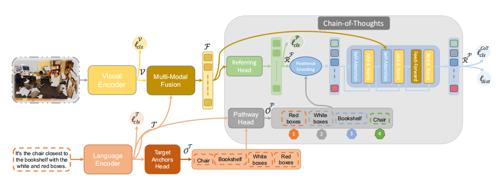
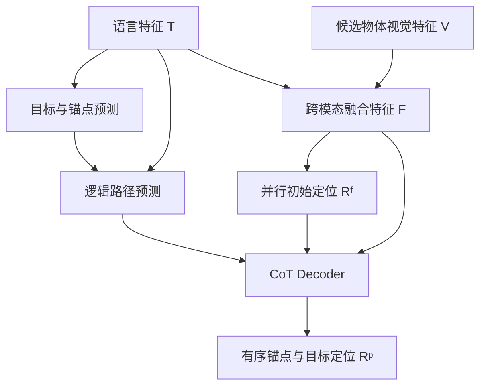

三维视觉定位（3D Visual Grounding）旨在根据自然语言描述，从三维场景中确定描述所指向的物体实例。该任务的难点不仅在于识别物体类别，还在于综合属性与空间关系，区分场景中多个同类别实例。例如，在“距离放有白色和红色盒子的书架最近的椅子”这一描述中，椅子的定位依赖于书架的识别，而书架又受到盒子属性及其空间关系的约束。

CoT3DRef 将这种依赖关系纳入预测过程：模型先识别描述中的参照物，即**锚点对象**，再预测锚点的逻辑顺序，最后结合锚点定位结果确定目标实例。由此，原本直接选择目标的任务被重构为包含锚点与目标的结构化序列预测任务。

本文关注三个问题：对象级定位链如何构建，自动生成的中间监督为何有助于有限数据下的学习，以及显式定位链能够在何种意义上提供解释。这里的 Chain-of-Thought（CoT）指由对象类别、定位顺序和实例预测组成的结构化中间过程，并不涉及自然语言推理文本的生成。

> 本文依据论文正文及附录整理。方法与实验部分复述作者的设计和报告结果；“讨论与局限”部分在此基础上给出分析。文中数值均来自原论文，未进行独立复现。

## 论文信息

| 项目 | 内容 |
| --- | --- |
| 标题 | CoT3DRef: Chain-of-Thoughts Data-Efficient 3D Visual Grounding |
| 会议 | ICLR 2024 |
| 研究机构 | King Abdullah University of Science and Technology（KAUST） |
| 研究主题 | 三维视觉定位、锚点监督、结构化序列预测、数据高效学习 |
| 核心思路 | 以自动伪标签提供中间监督，通过逻辑路径预测与链式解码联合定位锚点和目标 |

## 1. 任务定义与研究动机

### 1.1 从类别识别到实例消歧

给定三维场景 $S$、自然语言描述 $U$ 及候选物体集合 $\mathcal{P}=\{P_k\}_{k=1}^{L}$，三维视觉定位需要选择与描述对应的目标实例。为便于讨论，可将直接定位形式化为：

$$
\hat{t}=\underset{k\in\{1,\ldots,L\}}{\operatorname{argmax}}\;p_{\theta}(k\mid S,U)
$$

其中，$L$ 为候选物体数量，$\hat{t}$ 为预测目标的候选索引。即使模型已正确识别目标类别为 `chair`，仍需借助描述中的属性与关系，在多把椅子之间完成实例消歧。

在前述示例中，椅子是最终的**目标对象（target object）**，白色盒子、红色盒子和书架则是辅助定位的**锚点对象（anchor objects）**。一种可行的定位路径如下：


```mermaid
flowchart LR
    A[红色盒子] --> B[白色盒子]
    B --> C[书架]
    C --> D[目标椅子]
```

该路径表达的是定位步骤的组织方式，而非词语在句子中的出现顺序。红色盒子与白色盒子的先后次序也并非唯一；两者都可以为书架定位提供参照。这一区别关系到后文讨论的多路径歧义。

### 1.2 相对于已有方法的变化

已有三维视觉定位方法通常利用场景图、图神经网络、跨模态注意力或多视角特征，建模语言与场景之间的关系，并由定位头（referring head）输出最终目标。这些模型可以在特征层面编码对象关系，但其最终输出通常不足以说明中间参照物是否被正确识别和定位。

CoT3DRef 的关注点是**预测过程的显式结构**：除最终目标外，模型还预测锚点类别、逻辑顺序和锚点实例，使中间变量既能参与训练，也能供后续解码与错误分析使用。

PhraseRefer、ScanEnts 等工作同样引入了短语或锚点层面的监督，但依赖额外人工标注。CoT3DRef 则通过语言解析、几何关系匹配与 GPT-3.5 离线生成伪标签，以减少获取中间监督所需的人工成本。其研究问题因此可以概括为：在不新增人工锚点标注的条件下，显式组织对象之间的定位依赖，能否改善最终定位性能与数据利用效率？

## 2. 模型结构：对象识别、路径预测与链式定位



语言分支生成有序对象表示，视觉与语言融合分支提供初始定位结果和场景特征，两者共同输入 CoT Decoder。

### 2.1 场景编码与跨模态融合

输入场景由包含三维坐标及颜色信息的点云构成。模型首先获取候选物体区域（object proposals），这些区域可以来自三维检测器，也可以来自数据集的物体标注。视觉编码器将每个候选物体编码为 $d$ 维特征；语言编码器使用预训练 BERT 表示输入描述。记视觉特征与语言特征分别为：

$$
V=\{V_k\}_{k=1}^{L},\qquad T=\{T_j\}_{j=1}^{W}
$$

其中，$W$ 为文本序列的最大长度。跨模态融合模块进一步生成以语言为条件的候选物体特征：

$$
F=\{F_k\}_{k=1}^{L},\qquad F_k\in\mathbb{R}^{1\times d}
$$

CoT3DRef 对融合模块的具体形式不作统一限定，因此能够接入不同的基线架构。需要注意，后续的“定位”主要指确定对象对应的候选实例；文中的“位置细化”不应直接理解为对三维边界框坐标进行连续回归。

### 2.2 目标与锚点类别预测

Target Anchors Head 将传统的目标类别预测扩展为对目标和锚点的联合预测，得到对象序列 $O^T$。模型以 $M$ 表示最大对象序列长度，并使用 `no_obj` 类填充不足的部分。

该模块处理的是语言侧的对象类别信息。例如，描述中的 `chair`、`bookshelf` 和 `boxes` 分别提供目标或锚点类别，但类别预测本身尚未确定它们在三维场景中对应哪个实例。**对象类别识别与实例定位是两个不同层次的预测任务。**

### 2.3 逻辑路径预测

Pathway Head 接收语言特征 $T$ 与对象预测 $O^T$，输出按逻辑定位顺序组织的对象序列 $O^P$。论文采用单层 Transformer encoder 建模对象之间的关联，使预测顺序能够利用整句描述与其他对象的信息。

路径预测的作用，是为后续解码提供对象身份及逻辑步次信息。例如，模型可以先定位盒子，再定位与盒子相关联的书架，最后确定目标椅子。这种顺序编码表示定位链中的步骤，不是物体的三维坐标，也不是场景中的左右或前后方向。

### 2.4 并行初始定位与链式细化

视觉侧的 Parallel Referring Head 首先根据融合特征 $F$，并行预测目标与锚点的初始定位结果 $R^F$，此时不显式约束它们的逻辑顺序。CoT Decoder 随后结合 $R^F$、有序对象表示 $O^P$ 和融合特征 $F$，输出按路径组织的定位结果 $R^P$。


```mermaid
flowchart TD
    text[语言特征 T] --> objects[目标与锚点预测]
    objects --> pathway[逻辑路径预测]
    text --> pathway
    text --> fusion[跨模态融合特征 F]
    visual[候选物体视觉特征 V] --> fusion
    fusion --> parallel[并行初始定位 Rᶠ]
    pathway --> decoder[CoT Decoder]
    parallel --> decoder
    fusion --> decoder
    decoder --> output[有序锚点与目标定位 Rᵖ]
```

按原论文式（1）的简化记法，解码器以 $R^F+O^P$ 为查询，以 $F$ 为键和值，其交叉注意力权重为：

$$
Q=R^F+O^P,\qquad
A=\operatorname{Softmax}\left(\frac{QF^\top}{\sqrt{d}}\right)
$$

这里的加法作用于模型内部表示，不能理解为将物体的原始坐标与类别编号直接相加。$O^P$ 为初始定位表示补充逻辑顺序信息，$A$ 则描述查询与场景候选物体特征之间的关联。

在此之外，解码器通过带掩码的自注意力约束定位步骤之间的信息流，使后续步骤能够利用先前对象的定位信息。因此，整体结构可概括为“并行初始定位与顺序细化”：模型先获得一组初始预测，再在对象路径约束下更新这些预测。[方法来源：论文第 3.1–3.2 节](https://arxiv.org/html/2310.06214v4)

## 3. 中间监督：伪标签如何构造

原始定位数据集通常提供描述及其对应的目标标注，缺少完整的锚点类别、锚点顺序和锚点实例标注。CoT3DRef 为这三类中间变量设计了自动伪标签生成流程。

### 3.1 对象与关系解析

作者首先结合规则启发式方法和场景图解析器，从描述中提取对象及关系。例如，示例描述可拆解为以下关系：

```text
chair —— closest to —— bookshelf
bookshelf —— has —— white boxes
bookshelf —— has —— red boxes
```

对于 Nr3D 中不符合 ScanNet 标准类别名称的自由表达，方法进一步使用 SBERT 进行语义匹配。例如，`bookcase` 可以映射至 `bookshelf`。这一过程将语言中的对象提及转换为后续候选实例检索所需的类别信息。

### 3.2 逻辑顺序伪标签

作者使用 GPT-3.5，通过上下文学习（in-context learning）从描述中生成对象定位顺序，并据此训练 Pathway Head。

**GPT-3.5 用于离线构造训练标签，不参与三维定位模型的在线训练计算或测试推理。** 部署时，逻辑路径由训练后的 Pathway Head 预测。因此，推理阶段无需逐次调用大语言模型。

### 3.3 锚点实例伪标签

论文算法 1 将语言侧的锚点名称映射至场景中的候选物体，主要步骤为：

1. 根据对象类别检索同类候选实例。
2. 若候选唯一，则直接建立对应关系。
3. 若存在多个候选，则利用已解析的空间关系和已定位对象进行消歧；必要时递归定位关系中的参照对象。
4. 若仍无法确定对应实例，则从同类候选中随机采样。

随机回退使流程能够继续生成标签，但也会引入错误监督。作者在 Nr3D 的 10% 数据上进行了人工评估：自动路径与人工路径之间的平均归一化 Levenshtein 编辑距离为 0.18，几何模块生成的锚点实例标签准确率约为 77%。这两个指标分别衡量路径序列差异与锚点实例匹配质量，不能相互替代，也不同于训练后模型的最终目标准确率。[评估来源：论文第 5 节及附录 A.11](https://arxiv.org/html/2310.06214v4)

## 4. 多任务训练目标

CoT3DRef 在原有视觉分类与目标定位监督的基础上，扩展语言侧对象分类和视觉侧实例定位，并引入同类别干扰物判别损失。其总体训练目标为：

$$
\mathcal{L}
=\lambda_V\mathcal{L}_{\mathrm{cls}}^V
+\lambda_T\mathcal{L}_{\mathrm{cls}}^T
+\lambda_{\mathrm{ref}}\left(\mathcal{L}_{\mathrm{ref}}^P+\mathcal{L}_{\mathrm{ref}}^{\mathrm{CoT}}\right)
+\lambda_{\mathrm{dist}}\mathcal{L}_{\mathrm{dist}}
$$

| 损失项 | 监督对象与作用 |
| --- | --- |
| $\mathcal{L}_{\mathrm{cls}}^V$ | 候选物体的视觉类别预测 |
| $\mathcal{L}_{\mathrm{cls}}^T$ | 描述中目标与锚点的类别预测 |
| $\mathcal{L}_{\mathrm{ref}}^P$ | 并行阶段的目标与锚点实例定位 |
| $\mathcal{L}_{\mathrm{ref}}^{\mathrm{CoT}}$ | 链式解码后的目标与锚点实例定位 |
| $\mathcal{L}_{\mathrm{dist}}$ | 区分目标与同类别干扰物的辅助二分类 |

其中，$\lambda$ 表示各项损失的权重。需要区分符号用途：损失中的上标 $P$ 表示并行定位，而前文 $R^P$ 表示按逻辑路径组织的定位输出，二者沿用论文记号。

从监督来源看，CoT3DRef 仍使用原始数据集的目标标注，并额外构造锚点及路径伪标签。因此，它属于**引入自动中间监督的学习方法**。“无需额外人工锚点标注”并不意味着不使用标注数据，也不意味着中间监督不存在生成成本。

## 5. 实验设置与结果解读

### 5.1 数据集与实现配置

| 数据集 | 论文报告的数据规模 | 描述特点 |
| --- | --- | --- |
| Nr3D | 约 4.15 万条描述 | 人类自由表达，包含较复杂的语言及指代歧义 |
| Sr3D | 约 8.35 万条描述 | 合成描述，空间关系表达较为规范 |
| ScanRefer | 约 5.15 万条描述，涉及约 1.1 万个物体和 800 个室内场景 | 基于室内扫描场景的自然语言物体描述 |

作者将 CoT3DRef 接入 LAR、SAT、MVT 和 ViL 等架构，以考察该方法对不同基线的适用性。多数据集实验支持其在所评估设置中的有效性，但并不等同于训练于一个数据集、直接迁移至另一数据集的跨域泛化验证。

论文报告的主要配置包括：单层 Pathway encoder 和单层 CoT decoder、52 个候选物体、最大文本长度 24、每个候选物体采样 1024 个点，以及 768 维隐藏表示。Nr3D 与 Sr3D 的最大对象序列长度分别为 8 和 3。训练采用 Adam 优化器，初始学习率为 $10^{-4}$，共训练 100 个 epoch。具体复现仍需结合各基线的实现与预处理设置。

以下结果按原论文相应表格报告的定位准确率整理，单位均为百分比；差值使用“百分点”表示。比较时应保持候选物体来源、训练数据比例和评估协议一致，尤其不能将本文摘录的 ScanRefer 数值直接等同于其他工作中的不同 IoU 阈值指标。

### 5.2 消融：锚点监督与链式结构各自带来什么

论文表 1 以 MVT 为基线，对比原始模型、采用锚点监督的并行定位模型，以及完整的链式定位模型：

| 模型设置 | Nr3D：10% 数据 | Sr3D：10% 数据 | Nr3D：100% 数据 | Sr3D：100% 数据 |
| --- | ---: | ---: | ---: | ---: |
| 原始 MVT | 27.6 | 48.8 | 55.2 | 66.0 |
| 锚点监督 + 并行定位 | 31.7 | 55.3 | 57.0 | 71.5 |
| CoT 链式定位 | 37.5 | 65.2 | 60.0 | 72.7 |
| CoT 链式定位 + 干扰物损失 | 38.2 | 66.4 | 60.4 | 73.2 |

*数据来源：原论文表 1。百分比表示所用训练数据比例，测试集保持完整。表中并行定位是消融对照模型；完整 CoT 模型内部仍包含提供初始预测的并行定位头。*

这些结果支持区分两类收益。首先，加入锚点监督后，并行模型相较原始 MVT 已获得提升，说明中间对象监督本身具有价值。其次，在同样利用锚点标签的条件下，CoT 模型进一步改善性能，支持对象间依赖建模的有效性。

这一差异在有限数据设置下更为明显：使用 10% 训练数据时，CoT 相较并行模型在 Nr3D 和 Sr3D 上分别提高 5.8 和 9.9 个百分点；使用完整训练集时，相应增益为 3.0 和 1.2 个百分点。因此，表 1 支持链式结构在低数据条件下具有较大的相对价值，但尚不足以单独确定其全部作用机制。

### 5.3 基准比较与数据效率

论文表 4 和表 6 报告了以下 MVT 对照结果：

| 数据集与设置 | MVT | MVT + CoT3DRef | 提升（百分点） |
| --- | ---: | ---: | ---: |
| Nr3D，完整训练集 | 55.1 | 60.4 | 5.3 |
| Sr3D，完整训练集 | 64.5 | 73.2 | 8.7 |
| ScanRefer，完整训练集 | 57.4 | 64.2 | 6.8 |
| ScanRefer，10% 训练数据 | 36.4 | 48.6 | 12.2 |

*数据来源：原论文表 4、表 6。此处摘录准确率均值；不同表格中的 MVT 基线数值并不完全相同，例如表 1 的完整数据结果为 55.2/66.0，表 4 为 55.1/64.5。本文保留各表原值，并仅在同一实验表内计算增益。*

在 Sr3D 上，论文还报告 CoT3DRef 使用 10% 训练数据即可达到部分基线使用完整训练集时的性能水平。以表 1 为例，完整 CoT 模型使用 10% 数据达到 66.4%，原始 MVT 使用全部数据为 66.0%。这一结果说明，在该数据集及实验设置下，中间监督能够显著改善样本利用效率；它不意味着在所有数据集、所有基线或任意部署条件下都能减少 90% 的数据需求。[实验来源：论文第 4 节](https://arxiv.org/html/2310.06214v4)

### 5.4 锚点标签质量的影响

论文表 3 在 Nr3D 上比较了不同锚点监督条件下的 MVT + CoT：

| 锚点监督条件 | 最终目标准确率（%） |
| --- | ---: |
| 将锚点定位损失置零 | 55.0 |
| 自动伪标签 | 60.4 |
| 人工锚点标签 | 64.4 |

使用人工标签后，目标准确率提高 4.0 个百分点，表明改善中间监督质量仍有收益空间。这是针对所测试配置的参考上限实验，不是对模型理论上限的估计。

另一方面，将锚点定位损失置零后，模型性能回落至接近原始 MVT 的水平。这一对照强调了有效锚点监督的重要性，也不能据此推断模型在任意锚点错误分布下都具有鲁棒性。

### 5.5 解码深度与掩码方式

论文表 2 比较了 1、2、4 层 CoT decoder，结果差异较小，因此最终采用单层结构。这表明在作者考察的配置范围内，增加解码器深度没有带来明显收益；它并不能独立证明性能提升仅由任务分解导致。

附录 A.6 及表 9 进一步比较了 causal 与 non-causal 两个变体。在 MVT 上，两者的 Nr3D 准确率分别为 60.4% 和 60.9%，Sr3D 均为 73.2%。附录图 6 还展示了相应输入连接的调整，因此不宜将这一对照简单解释为仅修改掩码、其他条件完全不变。

这一结果至少表明，严格限制为单向信息流并非取得较高性能的必要条件。锚点监督、对象路径与解码结构的贡献，需要结合多个消融实验共同判断。

## 6. 讨论与局限

### 6.1 中间监督为何可能提高数据效率

从学习任务的角度看，直接目标监督主要约束最终实例选择，而锚点监督进一步约束模型对描述中其他对象的识别和定位。对于同一条描述，模型因而获得了更丰富的训练信号。路径结构还引入了对象依赖的归纳偏置，使参照物信息能够参与目标消歧。

这是对实验结果的一种合理解释，但论文并未通过理论分析或完全解耦的实验，确定额外监督、结构约束与其他训练因素分别贡献了多少。更准确的结论是：**自动中间监督与链式定位的组合，在所报告的有限数据实验中表现出较高的样本效率。** 样本效率也不同于总体计算效率，离线标签生成、解析规则及预处理的成本仍需单独考虑。

### 6.2 可解释性的范围

CoT3DRef 提供了可检查的锚点类别、路径顺序和实例预测，使错误分析可以从最终目标扩展到中间步骤。论文附录展示的失败案例表明，观察锚点定位与注意力分布，有助于发现早期参照物选择错误及其可能造成的后续影响。

但可观察的中间输出并不自动构成忠实的决策解释。某条路径在语义上合理，不能单独证明网络确实按照该路径所表达的空间关系完成推断；注意力可视化也不足以确立因果关系。因此，将其贡献表述为**增强定位过程的可观测性与错误诊断能力**更为审慎。

同样，论文中的 causal masking 指 Transformer 内部的信息流约束，不等同于统计学中的因果识别或因果推断。

### 6.3 伪标签噪声与路径歧义

对象名称匹配、关系解析和几何消歧都可能引入错误，无法消歧时的随机回退则进一步增加标签噪声。作者还指出，锚点定位规则依赖 ScanNet 的数据设置，迁移至其他三维场景数据时需要适配。

此外，同一描述可能对应多条合理路径。例如，先定位书还是先定位灯，都可能有助于确定二者所在的桌子。当前方法采用单一路径监督，未显式联合建模这些等价或近似等价的顺序。因此，路径预测与某一标签序列不一致，并不必然意味着空间推理无效。

### 6.4 误差传播与语言歧义

链式组织使中间结果能够被后续步骤使用，也可能使早期锚点错误影响最终目标。显式输出有助于定位这一问题，但并未从机制上消除误差传播。

视角依赖表达则构成另一类困难。例如，“从左边数第二把凳子”需要明确观察方向，仅有场景几何和文本未必足以唯一确定答案。论文报告的两套人工锚点标注之间约 80% 的匹配率，也提示标注存在不一致；不过，这一统计不能直接换算为整个数据集的错误率或模型性能上限。

### 6.5 候选实例与评估范围的限制

CoT3DRef 的定位能力建立在候选物体集合之上。如果目标实例在候选生成阶段被遗漏，后续的语言理解和链式解码无法通过候选选择恢复该实例。因而，在采用真实标注候选与检测器候选的实验之间，性能不能脱离候选质量直接比较。

同理，论文在若干室内场景基准与已有架构上获得的提升，支持该框架在这些设置中的适用性；对于开放场景、不同类别体系和分布外语言描述，其泛化能力仍需进一步验证。

## 7. 结语

CoT3DRef 的主要贡献，是将锚点类别、逻辑路径与实例定位纳入统一的结构化预测过程，并借助自动伪标签建立中间监督。其结果表明，除改进场景表征与跨模态融合之外，重新组织监督信号和定位步骤，也能改善三维视觉定位的性能，尤其是在训练样本有限的条件下。

对该方法的评价应同时考虑实验收益与适用边界：显式锚点链提供了更细粒度的诊断信息，但其质量受制于伪标签、候选实例和路径设定。后续研究值得关注的方向包括降低中间监督噪声、表示多条有效路径，以及通过更有针对性的干预实验检验定位链与最终决策之间的关系。

## 论文与项目链接

- [论文主页：CoT3DRef](https://eslambakr.github.io/cot3dref.github.io/)
- [论文摘要：arXiv:2310.06214](https://arxiv.org/abs/2310.06214)
- [本文核对版本：arXiv v4 全文](https://arxiv.org/html/2310.06214v4)
- [论文 PDF](https://arxiv.org/pdf/2310.06214)
- [代码仓库：CoT3D_VG](https://github.com/eslambakr/CoT3D_VG)
