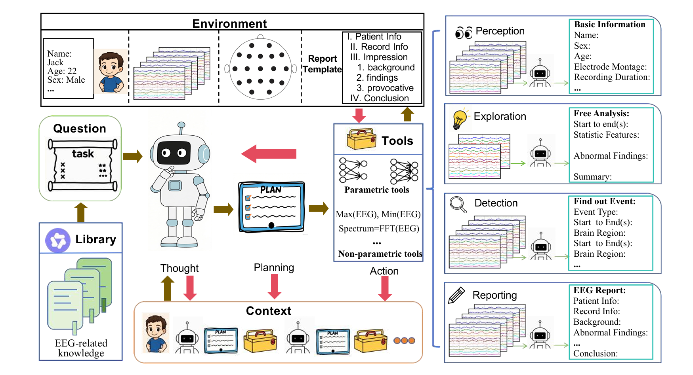

# EEGAgent：基于大语言模型的自动化 EEG 分析统一框架

现有的 EEG（Electroencephalography，脑电图）自动分析方法已经覆盖异常脑电识别、癫痫事件检测、睡眠分期、抑郁识别等多个任务。然而，这些方法大多围绕某一个预先定义的目标独立设计：一个模型负责一个任务，一个数据集对应一种标签体系，一个推理流程通常也在训练和部署之前被固定下来。

这种范式在标准化 benchmark 上是有效的，但与真实 EEG 分析流程之间仍存在明显差异。实际分析往往不是一次独立分类，而是一个连续过程：首先需要理解患者与记录的基本信息，随后观察背景节律，在发现异常后进一步缩小时间范围和空间范围，调用更细粒度的方法定位事件，最后再综合多种证据形成解释或报告。

**EEGAgent: A Unified Framework for Automated EEG Analysis Using Large Language Models** 针对这一问题提出了一种不同于“继续训练更强单任务模型”的解决思路：将已有的 EEG 模型、统计特征和信号处理方法封装为工具（tools），再由大语言模型负责理解任务、规划分析流程并动态调度这些工具，从系统层面完成多任务 EEG 分析。

> 本文前半部分主要整理论文原文提出的方法、实验与结果；“深度分析”部分则是在论文结果基础上的个人理解与讨论。

---

## 核心信息

**论文标题：** EEGAgent: A Unified Framework for Automated EEG Analysis Using Large Language Models\
**会议：** The Fortieth AAAI Conference on Artificial Intelligence（AAAI-26）\
**页码：** 18063–18071\
**研究方向：** EEG Analysis、Large Language Model Agent、Tool Planning、Clinical EEG Interpretation

**相关机构：**

- State Key Laboratory of Brain-machine Intelligence, Zhejiang University
- College of Computer Science and Technology, Zhejiang University
- Department of Neurobiology, Affiliated Mental Health Center & Hangzhou Seventh People’s Hospital, Zhejiang University School of Medicine
- MOE Frontier Science Center for Brain Science and Brain-machine Integration, Zhejiang University

---

## 一句话总结

> **EEGAgent 并不是让大语言模型直接替代 EEG 信号分析模型，而是将 LLM 作为任务规划器与工具调度器，根据用户问题、EEG 上下文以及中间分析结果，动态选择并组合不同的 EEG 工具，从而将原本彼此孤立的单任务方法组织为一个统一的、多阶段 EEG 自动分析框架。**

这一点是理解整篇论文最重要的前提。

在 EEGAgent 中，LLM 主要负责的是 **reasoning、planning、tool selection 与 reporting**；真正执行 EEG 信号处理、特征提取和事件分类的，仍然是底层的参数化模型与非参数化分析工具。

---

## 框架总览



*图 1：EEGAgent 整体框架，来源于论文 Figure 1。*

从图中可以将整个系统划分为几个核心组成部分：

- **Environment**：患者信息、EEG 原始记录、电极布局以及报告模板等运行环境；
- **Library**：EEG 领域知识库；
- **LLM Agent**：负责理解问题、思考和制定分析计划；
- **Tools**：由深度学习模型和传统统计/信号处理方法构成的工具箱；
- **Context**：保存环境信息、工具调用结果以及此前的分析过程；
- **Capabilities**：最终形成 Perception、Exploration、Detection 和 Reporting 等能力。

因此，EEGAgent 的整体逻辑并不是一个简单的

```text
EEG -> Model -> Prediction
```

而更接近：

```text
Question + EEG Environment + Knowledge
                    |
                    v
               LLM Agent
                    |
             Task Planning
                    |
                    v
               EEG Tools
                    |
              Tool Results
                    |
                    v
             Context Update
                    |
              Further Reasoning
                    |
                    v
          Analysis / Detection / Report
```

其中最关键的变化，是将 **EEG 模型从最终系统本身转化为可被调度的工具**。

---

## 创新点

### 1. 从单任务 EEG 模型转向统一任务调度框架

论文将现有 EEG 方法的主要局限概括为 **task isolation problem**。

传统自动 EEG 分析通常针对一个确定任务构建模型，例如：

```text
EEG -> Abnormal / Normal
EEG -> Seizure / Non-seizure
EEG -> Sleep Stage
EEG -> Depression / Healthy Control
```

这些模型可以分别完成各自的预测任务，但它们通常缺少对更大分析上下文的理解，也无法自行决定：

- 当前问题应该调用哪个模型；
- 第一次分析结束后是否还需要进一步分析；
- 应该扩大还是缩小时间范围；
- 是否需要从全局判断切换到单通道定位；
- 多种工具产生的结果应该如何整合。

EEGAgent 因此没有尝试训练一个同时完成所有 EEG 任务的单一网络，而是将问题重新定义为：

> **如何利用一个具有上下文理解与规划能力的 Agent，对多个专用 EEG 工具进行统一调度？**

从这个角度看，论文的主要贡献更接近 **workflow orchestration**，而不是一个新的 EEG representation learning backbone。

### 2. 将 LLM 放在控制层，而非直接承担 EEG 信号建模

EEGAgent 以 **Qwen3-235B** 作为主要的大语言模型控制器，并使用 **Qwen3-Embedding-8B** 完成任务描述与 EEG 领域知识之间的语义检索。

当一个新任务到来时，系统首先根据任务描述检索相关 EEG 知识，将检索结果加入上下文；随后由 Qwen 综合任务要求、EEG 数据环境以及已有分析结果制定计划并选择工具。

因此可以将两类模块的职责区分为：

| 模块 | 主要职责 |
|---|---|
| LLM / Agent | 任务理解、上下文推理、分析规划、工具选择、结果整合、报告生成 |
| EEG Tools | 信号处理、统计特征提取、分类、事件检测、时空定位 |

这一区分非常重要。EEGAgent 的核心并不是“LLM 直接读懂原始 EEG”，而是让 LLM 决定 **应该如何分析 EEG**。

### 3. 同时组织参数化与非参数化 EEG 工具

EEGAgent 的工具箱同时包含两类方法：

- **Parametric tools**：由数据训练得到的深度学习模型；
- **Non-parametric tools**：基于统计特征或传统信号处理的方法。

这使得系统既能够调用高层语义分类模型，也能够获得幅值、功率谱、左右对称性等更基础、更可解释的量化信息。

论文中的主要工具如下。

| Tool Name | Type | Time Granularity | Space Granularity | Description |
|---|---|---|---|---|
| `normalAbnormal` | Parametric | Full EEG | Whole Channel | 判断整段 EEG 的病理性正常/异常概率 |
| `eyemMuscle` | Parametric | 1 s | Single Channel | 检测单通道 1 秒窗口中的眼动和肌电伪迹 |
| `seizArtiBckg` | Parametric | 1 s | Single Channel | 区分 seizure、artifact 与 background |
| `seizNormal` | Parametric | 1 s | Single Channel | 检测 seizure 与 non-seizure |
| `slowSeizBckg` | Parametric | 10 s | Whole Channel | 区分 slow wave、epileptic activity 与 background |
| `baseInfo` | Non-parametric | Full EEG | Whole Channel | 提取患者人口学信息与 EEG 记录元数据 |
| `compute_amplitude` | Non-parametric | ≤ 60 s | Whole Channel | 计算 mean absolute amplitude、RMS、max/min 等幅值特征 |
| `compute_psd` | Non-parametric | ≤ 60 s | Whole Channel | 计算不同频段的功率谱密度 |
| `compute_symmetry` | Non-parametric | ≤ 60 s | Left-Right Channel Pair | 使用 Pearson correlation 评估左右通道对称性 |

这套设计实际上将传统信号处理、深度学习模型和 LLM Agent 放入了同一个分析体系中。

### 4. 引入多时间尺度与多空间尺度的 coarse-to-fine 分析

EEG 信号具有明显的非平稳性，而临床相关事件可能只存在于很短的时间段和局部脑区。如果始终使用同一种时间尺度进行分析，要么计算代价较高，要么容易丢失细粒度事件。

EEGAgent 因此采用由粗到细的多粒度策略：

```text
Long / Coarse Window
        |
  Suspicious Event?
     /       \
   No         Yes
   |           |
Continue    Fine Window
               |
          Channel-level
               |
     Spatiotemporal Localization
```

论文在事件检测过程中主要使用 **10 秒与 1 秒两个时间尺度**：先通过较粗的时间窗口进行筛查，当发现可能存在目标事件时，再进入 1 秒级别的精细分析，并进一步结合单通道与多通道信息完成空间定位。

这种设计的意义在于：分析精度与计算成本不再由固定 pipeline 决定，而可以由 Agent 根据任务和中间结果动态调整。

### 5. 将分析结果进一步转换为结构化 EEG 报告

传统模型通常输出类别标签或概率，但完整的 EEG 分析还需要将背景节律、异常事件、空间位置、时间信息等结果整合为具有临床可读性的描述。

EEGAgent 参考 ACNS EEG reporting guideline，将报告划分为患者信息、记录信息、背景活动、异常发现和结论等组成部分，并通过多尺度分析结果填充报告模板。

因此，系统试图打通：

```text
Raw EEG
   -> Signal Analysis
   -> Event Detection
   -> Spatiotemporal Localization
   -> Contextual Reasoning
   -> Structured EEG Report
```

从系统设计上看，这比单独输出一个分类标签更接近真实 EEG 工作流。

---

## 原文摘要翻译

可扩展且具有良好泛化能力的脑活动分析对于推动临床诊断和认知研究具有重要意义。脑电图（EEG）是一种具有高时间分辨率的非侵入式检测方式，已被广泛用于脑状态分析。然而，现有大多数 EEG 模型通常针对某一个特定任务设计，这限制了它们在真实场景中的应用能力，因为实际 EEG 分析通常涉及多任务以及连续推理。

在这项工作中，作者提出 **EEGAgent**：一个利用大语言模型对多个工具进行调度与规划，从而自动完成 EEG 相关任务的通用框架。EEGAgent 能够执行几类关键功能，包括 EEG 基本信息感知、EEG 时空探索、EEG 事件检测、用户交互以及 EEG 报告生成。

为了实现这些能力，作者设计了一个由 EEG 预处理、特征提取、事件检测等不同工具构成的工具箱，并在公开数据集上对这些能力进行了评估。实验表明，EEGAgent 能够支持灵活且具有可解释性的 EEG 分析，并展现出应用于真实临床场景的潜力。

---

## 研究问题

这篇论文关注的核心问题并不是某一个 EEG 分类任务本身，而是 **现有 EEG 自动分析体系在多任务和连续分析场景下的组织问题**。

### Task Isolation

现有机器学习与深度学习方法已经在 seizure detection、sleep staging、neurological disorder diagnosis 等任务中取得了较好的效果，但这些方法通常针对孤立目标进行优化。

真实 EEG 分析却可能同时涉及：

- 对整段记录进行正常/异常判断；
- 观察背景活动与节律；
- 发现可疑事件；
- 精确定位事件发生的时间；
- 判断异常信号对应的脑区或通道；
- 根据患者年龄等上下文解释结果；
- 最终形成结构化报告。

因此，论文希望回答的问题可以进一步概括为：

> **能否构建一个统一且可扩展的 EEG 分析框架，使其能够根据任务目标和中间结果动态决定分析步骤，而不是为每个任务预先固定一套独立 pipeline？**

EEGAgent 给出的答案是：利用 LLM Agent 的任务规划、上下文推理和工具调用能力，将多个 EEG 分析模块组织为动态工作流。

---

## 数据以及任务定义

论文使用五个公开 EEG 数据集测试不同层面的能力。

| Dataset | 数据规模与特征 | 主要用途 |
|---|---|---|
| TUAB | 2,993 条记录，每条约 20 min；10–20 montage；250 Hz；1,521 normal / 1,472 abnormal | Recording-level normal/abnormal classification、Perception、Exploration、Report Generation |
| TUEV | 518 条记录；1 s、per-channel annotations；包含 PLED、GPED、SPSW、EYEM、ARTF、BCKG 六类事件 | Event detection 与时空定位 |
| TUSL | 300 个 10 s segments，来自 75 sessions / 38 patients；TCP-REF；256 Hz | Slow wave、seizure 与 background 的粗粒度分析 |
| Sleep-EDF | 197 个 full-night sleep recordings，包含 EEG、EOG、EMG | Sleep-stage classification |
| MDD Patients and Healthy Controls | 34 名 MDD 患者与 30 名健康对照 | Depression recognition |

这五个数据集覆盖了从全局记录判断，到秒级事件检测，再到不同临床/认知任务的多种 EEG 分析需求。

其中，TUAB、TUEV 和 TUSL 提供了不同时间与空间粒度的标签结构，也与 EEGAgent 的多粒度工具调度设计形成对应关系。

---

## 方法主线

### 1. Perception：建立 EEG 环境上下文

EEGAgent 首先需要理解自己正在分析什么数据。

系统通过 `baseInfo` 等模块提取：

- 患者姓名、性别、年龄等基本信息；
- EEG 总记录时长；
- electrode montage；
- 可用通道；
- 通道与脑区之间的空间对应关系。

论文特别强调年龄因素。不同年龄阶段具有不同的典型 EEG 背景特征，因此系统将相关临床知识预先整理到知识模块中，使 Agent 在真正开始任务分析前就能够建立基本的上下文预期。

这里的核心思想是：

> EEG 不应该脱离患者与记录环境被孤立解释。

### 2. Knowledge Retrieval：利用 EEG 领域知识增强上下文

EEGAgent 内部维护 EEG-related knowledge library。

当任务到来后，系统使用 **Qwen3-Embedding-8B** 将任务描述编码为语义向量，并通过相似度搜索从知识库中检索相关内容，再将检索结果加入 Qwen 的上下文。

因此，系统并不是完全依赖 LLM 参数内部已有的 EEG 知识，而是通过检索机制引入领域先验。

### 3. Planning：根据问题动态制定分析计划

完成基本信息感知与知识检索之后，Qwen 综合：

```text
User Question
+ EEG Environment
+ Retrieved EEG Knowledge
+ Previous Tool Results
+ Interaction Context
```

决定下一步应该调用哪些工具。

这也是 EEGAgent 与固定 pipeline 最核心的区别之一：

> **分析流程不是完全在系统设计阶段写死，而是在任务执行阶段由 Agent 根据上下文动态生成。**

### 4. Exploration：针对指定 EEG 区间进行多角度探索

对于用户指定或系统发现的时间范围，EEGAgent 会将其划分为多个时间片段，并根据上下文为不同片段选择相应工具。

工具可能返回：

- statistical feature vectors；
- classification probabilities；
- event labels；
- symbolic descriptions。

随后 Agent 需要继续整合不同工具的结果，并生成对整个目标时间区间的语义总结。

因此，Exploration 并不是某一个固定模型，而是一类由 Agent 组织的多工具分析过程。

### 5. Detection：从粗粒度筛查到精确时空定位

在事件检测中，EEGAgent 采用 hierarchical multi-scale strategy。

首先进行较粗时间粒度的扫描；当某个时间段被认为可能存在目标事件后，系统切换到更细粒度的 1 秒分析，并进一步检查相关通道，从而回答三个问题：

```text
What?  -> Event Type
When?  -> Start / End Time
Where? -> Channel / Brain Region
```

这种设计使事件检测从简单的 recording-level classification 转化为 **spatiotemporal event localization**。

### 6. Interaction & Reporting：连续交互与报告生成

EEGAgent 会保存此前对话与工具调用形成的上下文，因此用户可以继续提出后续问题，例如要求重新分析某个时间范围或进一步解释一个异常结果。

在报告阶段，系统首先以较粗时间尺度扫描整个 EEG；如果 Qwen 判断某个片段需要更细分析，再调用 1 秒级别工具。不同粒度的结果最终被写入结构化模板，再由模板机制或 Qwen 组织为自然语言报告。

整个流程可以概括为：

```text
Question
   |
   v
Environment Perception
   |
   v
Knowledge Retrieval
   |
   v
LLM Planning
   |
   v
Tool Selection & Execution
   |
   v
Result -> Context
   |         |
   |         v
   +---- Further Reasoning
             |
        More Tools ?
          /     \
        Yes      No
         |        |
         +--------+
             |
             v
      Analysis / Report
```

---

## 一个典型案例：分析第 5 到第 6 分钟的 EEG

论文在 TUAB 上给出了一个很能体现 Agent 特性的案例。

用户仅输入：

> **Analyze the EEG condition from minute 5 to 6.**

这个问题只给出了分析时间范围，并没有规定模型、特征或分析步骤。

EEGAgent 首先调用 `slowSeizBckg` 对 300–360 s 的 EEG 进行较粗粒度分析。工具返回较高的慢波概率后，Agent 继续调用 `compute_amplitude`，进一步分析相关波形在不同通道上的幅值特征和空间分布。

最后，系统将：

- 高层分类结果；
- 低层量化特征；
- 波形空间分布；
- 患者上下文；

整合到同一推理过程中，并给出该时间段存在持续性广泛慢波活动、同时没有明显 seizure 或显著 asymmetry 的总结。

这个案例说明 EEGAgent 的主要价值并不只是调用一个分类器得到结果，而是：

> **根据第一次分析产生的信息，自主决定“下一步还需要看什么”。**

---

## 关键结果

### 1. EEG Event Detection

作者在 TUEV 数据集上使用 SPSW、GPED 与 PLED 作为正类进行癫痫相关事件检测，并比较了不同规模 Qwen3 backbone 对 Agent 表现的影响。

| LLM Backbone | Hit Rate | False Alarm Rate |
|---|---:|---:|
| Qwen3-235B | **69.30%** | **44.77%** |
| Qwen3-32B | 60.84% | 55.66% |
| Qwen3-14B | 58.04% | 60.02% |

随着 LLM 规模增大，Hit Rate 上升，同时 False Alarm Rate 下降。

这一结果说明在 EEGAgent 中，系统性能不仅由底层 EEG detector 决定，**负责工具规划与决策的 LLM 本身也成为最终性能的一部分**。

### 2. 工具调用效率

论文同时报告了部分较小 LLM backbone 的工具调用效率：

| LLM Backbone | Average Tool Calls / Task | Runtime / Call |
|---|---:|---:|
| Qwen3-32B | 2.01 | 12.5 s |
| Qwen3-14B | 1.93 | 10.6 s |

论文在该处没有给出 Qwen3-235B 对应的平均工具调用次数和单次运行时间，因此这里不做额外补充。

### 3. MDD Recognition

在 MDD Patients and Healthy Controls EEG Data 上，论文报告：

| Metric | Result |
|---|---:|
| Accuracy | **83.33%** |
| F1-score | **84.34%** |

### 4. Sleep-stage Classification

在 Sleep-EDF 上，论文报告：

| Metric | Result |
|---|---:|
| Accuracy | **82.31%** |
| Macro-F1 | **76.27%** |

作者利用 MDD 与 Sleep-EDF 的结果说明 EEGAgent 能够适配不同 EEG 分析任务，而不只局限于癫痫事件检测。

### 5. Report Generation

论文还在 TUAB 上进行了自动报告生成的 feasibility evaluation。

由于 TUAB 本身缺少与每条 EEG 一一配对的临床报告，作者没有进行严格的 paired-report quantitative evaluation，而是按照 ACNS 标准设计自动报告任务。

生成结果能够覆盖：

- Patient Info；
- Record Info；
- Background；
- Abnormal Findings；
- Conclusion。

论文据此说明 EEGAgent 已能够将信号分析结果组织为具有临床结构的自然语言输出，但这一部分目前更接近 **可行性验证**，而不是对临床报告质量的完整定量证明。

---

## 深度分析

### 1. EEGAgent 的核心创新是系统级统一，而不是表示级统一

如果从传统 EEG deep learning 的视角出发，一个自然的问题是：

> 能否训练一个足够大的 EEG foundation model，使一个模型直接完成所有任务？

EEGAgent 提供的是另一条路线。

它没有要求一个统一模型同时掌握 seizure detection、slow-wave analysis、artifact detection、statistical analysis 与 report generation，而是将多个专用模块保留下来，再通过 Agent 将它们组织到同一工作流中。

因此可以将两种路线抽象为：

```text
Route A:
One General EEG Model -> Multiple Tasks

Route B:
One General Agent + Multiple Specialized EEG Tools -> Multiple Tasks
```

EEGAgent 属于第二种路线。

这意味着论文所强调的 general-purpose，更接近 **system-level / workflow-level generalization**，而不是“一个 EEG encoder 已经获得了统一的脑电表示”。

### 2. Model 不再等于 System，而是成为 System 中的 Tool

我认为这是这篇论文最值得关注的范式变化。

传统 EEG 论文通常把模型本身视为研究系统的主体：输入 EEG，模型输出预测，任务到此结束。

EEGAgent 中，模型被进一步抽象为：

> **具有明确输入、输出、时间粒度、空间粒度和计算成本的 Tool。**

一旦完成这种抽象，系统关注的问题就从：

> “哪个模型准确率最高？”

扩展为：

> “当前问题需要哪些证据？”\
> “应该以什么顺序获得这些证据？”\
> “什么时候需要进行更细粒度分析？”\
> “多个模型结果发生冲突时应该如何继续？”

这与真实分析流程之间的距离显然更近。

### 3. Agent Planner 本身成为 EEG 系统新的性能变量

TUEV 实验中，不同规模 Qwen3 在相同框架下产生了明显不同的 Hit Rate 与 False Alarm Rate。

这说明 Agent 系统引入了传统 EEG pipeline 中并不显著的一层变量：

> **Planning Quality**

过去，一个 EEG 系统的性能通常主要由数据集、特征提取器、网络结构、训练策略和损失函数决定。

而在 Agent 框架下，可以进一步写成：

```text
System Performance
~= Tool Quality
 x Planning Quality
 x Context Quality
 x Knowledge Quality
```

这里并不是严格的数学关系，而是一种系统层面的理解：任何一个环节出现明显误差，都可能影响最终结果。

这也意味着未来即使不重新训练底层 EEG 模型，仅仅改进 planner、tool selection 或 context management，也可能提升整个系统的任务表现。

### 4. “通用 EEG Agent”仍然受到 Tool Availability 的限制

EEGAgent 的灵活性建立在一个明确前提上：

> **工具箱中必须存在能够完成目标分析的工具。**

如果系统面对一种完全新的 EEG 任务，而工具箱中不存在对应模型、统计分析方法或可复用工具，那么 LLM 本身并不能凭空产生一个经过临床验证的 detector。

因此，它的通用性不是无限的。

更准确地说，EEGAgent 当前展示的是：

- 可以根据任务改变 workflow；
- 可以动态组合已有工具；
- 可以在不同粒度之间切换；
- 可以将多来源结果组织为统一解释。

但它并没有证明：LLM 可以绕过底层模型的能力边界，直接解决任意新的 EEG decoding problem。

### 5. Agent 的上限仍然受到底层工具质量约束

LLM 可以帮助系统决定何时调用 seizure detector，也可以根据其他证据判断是否需要进一步确认，但它无法完全消除 detector 自身的误差。

因此 EEGAgent 更合理的价值在于：

- 组合多种证据；
- 减少不必要的高成本分析；
- 根据上下文选择不同粒度；
- 将局部模型输出放入更完整的解释链中。

而不是简单地通过 LLM 将一个性能有限的 EEG 模型“变成”一个高精度模型。

### 6. 当前实验更充分地证明了“可行性”，而不是完整的临床有效性

论文的实验已经展示了 Perception、Exploration、Detection 与 Reporting 等完整能力链条，但从临床应用角度仍存在进一步验证空间。

首先，在 TUEV 癫痫相关事件检测中，Qwen3-235B 的 Hit Rate 为 69.30%，False Alarm Rate 为 44.77%。这一结果能够说明 Agent 驱动的 coarse-to-fine detection workflow 可以工作，但距离高可靠性临床自动诊断仍然存在差距。

其次，自动报告生成由于缺少 paired clinical reports，主要采用 feasibility evaluation。因此目前可以较好地说明系统“能够生成结构完整的 EEG 报告”，但还不能仅凭这一实验得出“报告质量已经达到临床专家水平”的结论。

另外，从论文给出的实验结构来看，事件检测部分重点比较了不同 LLM backbone 的效果。若要进一步量化 Agent planning 本身带来的增益，还可以考虑加入固定规则 pipeline、无 LLM planner 的工具组合或更系统的 ablation study 作为对照。

### 7. 这篇论文最重要的价值可能不是当前指标，而是 EEG 系统设计范式

如果只从单个 benchmark 数值观察，EEGAgent 的贡献并不主要体现在刷新某项 EEG SOTA。

它更值得关注的地方在于，将 EEG 自动分析重新组织为：

```text
EEG Data
   +
Specialized EEG Models
   +
Signal-processing Tools
   +
Domain Knowledge
   +
LLM Planner
   +
Interaction Context
   |
   v
Unified EEG Analysis Agent
```

在这种体系下，未来 EEG AI 的研究对象不再只有单个模型，还可能包括：

- Tool interface 如何标准化；
- Planner 如何判断工具可靠性；
- 多工具结果如何进行 uncertainty-aware fusion；
- Agent 如何在计算成本与分析精度之间进行决策；
- 如何避免 LLM 在临床报告中产生超出工具证据的推断；
- 如何建立能够评价完整 EEG Agent workflow 的 benchmark。

从这个角度看，EEGAgent 更像是在探索从 **EEG Model** 到 **EEG Analysis System** 的过渡。

---

## 总结

这篇论文最初吸引我的地方，是它没有继续沿着“为某个 EEG 任务再设计一个新网络”的传统路线推进，而是开始关注已经存在的大量 EEG 模型应该如何被组织起来。

现有 EEG 方法大多面向特定任务设计，而真实 EEG 分析往往需要多阶段、跨粒度、连续的判断过程。EEGAgent 因此利用大语言模型承担任务理解、规划和工具调度，将参数化深度学习模型、非参数化信号处理工具、EEG 知识库以及报告生成模块连接到统一框架中。

我认为理解这篇论文时，最重要的不是把它概括为“LLM 用于 EEG”，而是更具体地认识到：

> **LLM 在这里承担的是 EEG analysis workflow 的控制层。它不直接取代已有 EEG 模型，而是决定在什么情况下、以什么顺序、以什么粒度使用这些模型。**

从单任务模型到可规划的多工具 Agent，本质上是研究对象从“模型能力”进一步扩展到了“系统能力”。这也是 EEGAgent 最值得关注的地方。

---

## 论文与项目链接

- **AAAI 官方页面：** https://ojs.aaai.org/index.php/AAAI/article/view/38867
- **AAAI 官方 PDF：** https://ojs.aaai.org/index.php/AAAI/article/view/38867/42829
- **DOI：** https://doi.org/10.1609/aaai.v40i21.38867
- **arXiv：** https://arxiv.org/abs/2511.09947
- **GitHub：** https://github.com/rebootingLine/EEGAgent
