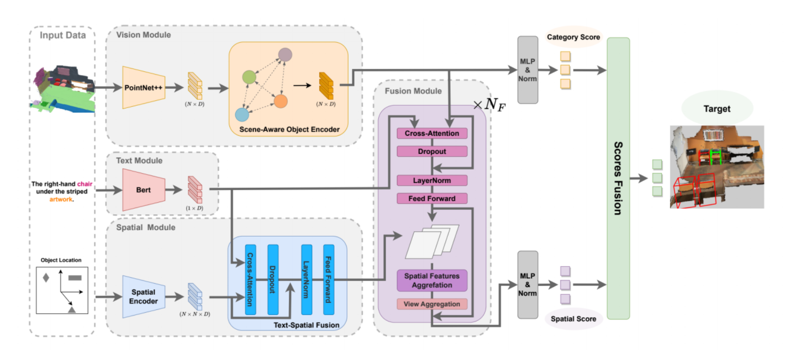
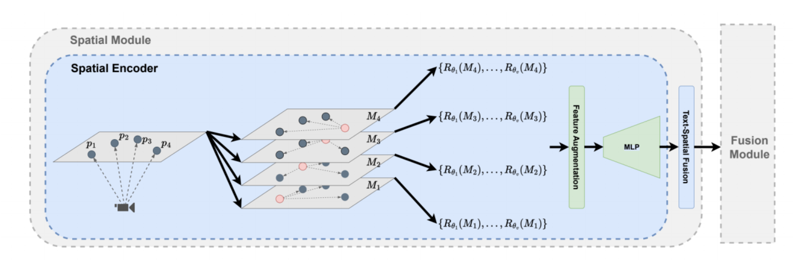
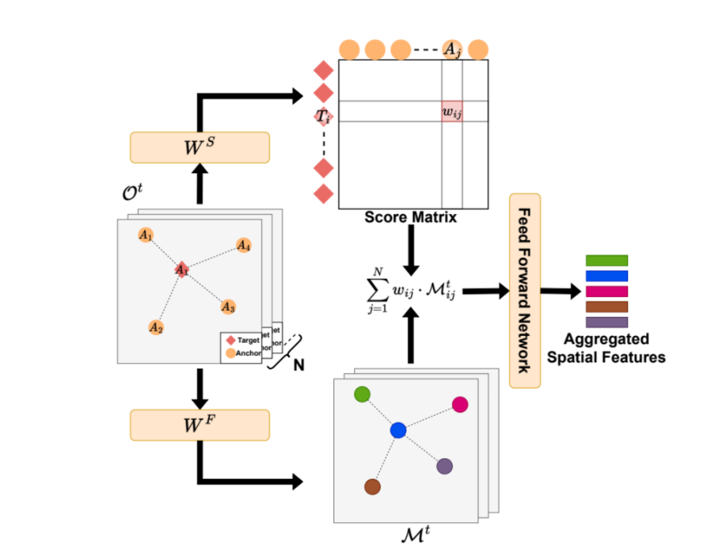

三维视觉定位（3D Visual Grounding）要求模型根据自然语言描述，从三维场景的候选物体中确定所指向的目标实例。这个任务同时涉及物体识别、语言理解与空间关系建模：模型既需要判断哪些物体属于描述中的目标类别，也需要利用参照物及其相对位置，在多个相似实例之间完成消歧。

例如，“靠近窗帘的床前面的行李箱”包含相互依赖的空间约束。行李箱是目标，床是直接参照物，而窗帘进一步限定了是哪一张床。如果仅根据行李箱的外观，或孤立地处理它与床之间的距离，就可能无法唯一确定目标。

**MiKASA: Multi-Key-Anchor & Scene-Aware Transformer for 3D Visual Grounding** 围绕这一问题，将场景上下文、多锚点关系与分支预测结合起来：先提升物体语义表征，再建立以候选物体为中心的相对空间图，通过语言引导的多层交互提取关键锚点信息，最终融合类别与空间两类分数完成定位。

> 本文依据 CVPR 2024 正文及官方补充材料整理。方法和实验部分说明作者的设计与报告结果，讨论部分给出个人分析。文中实验数值均来自原论文，未进行独立复现；用于解释机制的示意权重不属于实验结果。

## 论文信息

| 项目 | 内容 |
| --- | --- |
| 标题 | MiKASA: Multi-Key-Anchor & Scene-Aware Transformer for 3D Visual Grounding |
| 作者 | Chun-Peng Chang、Shaoxiang Wang、Alain Pagani、Didier Stricker |
| 会议 | CVPR 2024，14131–14140 |
| 研究机构 | DFKI Augmented Vision |
| 评估基准 | ReferIt3D：Nr3D、Sr3D |
| 核心设计 | 场景感知物体编码、多锚点相对空间表示、渐进式融合、类别与空间分数的后期融合 |

## 1. 任务定义与研究动机

给定场景中的候选实例集合 $\mathcal{P}=\{P_i\}_{i=1}^{N}$ 及文本描述 $U$，模型为每个候选实例产生匹配分数，并选择得分最高的实例：

$$
\hat{i}=\underset{i\in\{1,\ldots,N\}}{\operatorname{argmax}}\;s_i(\mathcal{P},U).
$$

这里的 $P_i$ 表示一个物体实例的点云，$N$ 为候选数量。论文主要关注给定候选集合后的实例选择，其实验候选来自真实标注。因此，这里的定位准确率不能直接解释为从原始场景开始、包含检测误差的完整系统性能。

### 1.1 物体本身可能没有被正确识别

点云无序、稀疏且采样密度不均，三维训练数据的规模也相对有限。即使使用 PointNet++，模型仍可能无法仅凭局部几何与颜色准确区分物体类别。

传统的对象级编码通常分别处理各个物体，容易忽略场景语义。例如，相似的长方体几何出现在厨房和浴室中，可能对应不同设备；周围物体能够为这种判断提供额外证据。MiKASA 因而在 PointNet++ 后增加场景感知编码器，使物体表征能够利用同一场景中的上下文。

### 1.2 空间表示与语言中的关系结构存在差距

论文指出，部分已有方法主要编码物体在世界坐标系中的绝对位置，而自然语言经常通过其他物体定义目标位置，例如“桌子旁”“床前”“两把椅子之间”。绝对坐标并非不能表达关系，但模型需要从这些坐标中自行学习描述所依赖的参照系。

MiKASA 显式构造物体之间的相对位置，并让多个潜在锚点共同参与定位。关键参照物还可以提供朝向线索，例如桌子或墙面的位置有助于推测椅子的朝向。

这里应区分两类问题：**点集无序性与旋转不变性不是同一概念**，PointNet++ 也不能笼统地被视为对任意旋转严格不变。更稳妥的理解是，物体编码和数据增强可能弱化方向信息，而邻近物体的空间配置能够补充朝向线索。该设计缓解方向歧义，并不保证所有视角相关表达都能被唯一解释。

### 1.3 单一输出难以支持细粒度错误诊断

如果模型只给出一个最终定位分数，就较难判断错误源自类别识别，还是关系理解。MiKASA 将预测拆成两个具有不同侧重点的分支：

| 分支 | 主要回答的问题 |
| --- | --- |
| Category Score | 当前物体是否属于文本所要求的目标类别？ |
| Spatial Score | 当前物体与其他物体的关系是否符合文本描述？ |

两个分支在最后进行分数融合，使分析者能够观察它们分别偏向哪些候选。这种结构增强了决策的可观测性，但不等同于给出了完整、具有因果保证的推理解释。

## 2. 框架总览

*图 1：MiKASA 整体架构，来源于论文 Figure 2。视觉分支提供场景感知的物体表征；空间分支编码相对位置并与文本交互；多层融合模块更新对象与空间特征；最终融合类别和空间分数。*

整个框架包含四个主要模块。

| 模块 | 输入与作用 |
| --- | --- |
| Text Module | 使用预训练 BERT 编码描述，提供语言特征及目标类别预测所需的表示 |
| Vision Module | 先由 PointNet++ 编码各物体，再通过场景感知编码器聚合对象上下文 |
| Spatial Module | 构建多锚点、多视角的相对空间表示，并进行一次文本—空间融合 |
| Fusion Module | 反复执行文本—物体交互、物体—空间交互、锚点聚合和视角聚合 |

下文使用 $O_i^t$ 表示第 $t$ 层的候选物体表示，$T$ 表示文本表示，$M_{ij}^t$ 表示该层中候选目标 $i$ 与潜在锚点 $j$ 对应的融合特征。原始几何关系经过编码与交互后，已经不再只是一个坐标差向量。

## 3. 场景感知物体编码：利用上下文识别对象

PointNet++ 首先将每个物体点云编码为 $D$ 维向量，形成 $O\in\mathbb{R}^{N\times D}$。随后，场景感知编码器在物体层面执行自注意力。沿用论文式（1）的写法：

$$
O_i^{\mathrm{sa}}
=\sum_{j=1}^{N}
\frac{\exp(Q_i\cdot K_j)}{\sum_{k=1}^{N}\exp(Q_i\cdot K_k)}V_j,
$$

其中 $Q$、$K$、$V$ 均由物体特征经过可学习的线性映射得到。每个物体通过注意力权重吸收其他物体的信息，使编码结果包含场景上下文。

这里的“周围物体”不应被理解为固定半径内的几何邻居。相比先用欧氏距离构图的方案，自注意力无需预先指定邻居距离，而是学习哪些对象对当前表征更有用。论文将其与采用十近邻构图的 GCN 进行了比较。

作者选择自注意力，也考虑了计算、训练与邻域定义的便利性。不过，这并不意味着自注意力在所有规模下都比图网络更省计算；标准全局注意力仍需要处理对象之间的成对交互。

## 4. 空间编码：从绝对坐标到多锚点相对关系

*图 2：空间模块，来源于论文 Figure 3。每个物体依次作为局部坐标原点，构建相对空间图；再生成旋转视角，增强并映射几何特征，最后与语言表示融合。*

### 4.1 每个候选目标对应一张空间图

设各物体的位置为 $\{p_1,\ldots,p_N\}$。论文式（2）以候选目标 $p_i$ 为原点，将其他物体作为潜在锚点：

$$
M_i=\{p_j-p_i\mid j\ne i\}.
$$

因此，$N$ 个候选物体对应 $N$ 张空间图。对第 $i$ 张图而言，它表达的是“如果物体 $i$ 是目标，其他物体分别处于什么相对位置”。

这一区分有助于理解图中的角色：**target 与 anchor 是相对于当前空间图定义的**。同一个物体可以在自己的图中作为候选目标，在其他图中作为潜在锚点。模型并没有在构图前就确定真正的目标或关键参照物。

“以物体为参照”也不意味着已经建立了与该物体自身朝向对齐的坐标轴。坐标平移消除了全局原点的影响，但方向仍受坐标朝向影响，因此还需要视角增强与后续融合。

### 4.2 多视角增强与几何特征扩展

模型对每张相对空间图施加不同角度的旋转：

$$
M^{\mathrm{aug}}
=\{R_{\theta_k}(M_i)\mid i=1,\ldots,N;\ k=1,\ldots,V\}.
$$

官方补充材料采用四个均匀分布的旋转视角，可等价写为 $0^\circ,90^\circ,180^\circ,270^\circ$。这些视角来自三维位置的旋转变换，不是额外采集的四张二维图像。

随后，空间编码器对相对几何特征进行增强。对于某一目标—锚点对的相对坐标 $(x,y,z)$，补充材料给出的核心量包括：

$$
d_{xy}=\sqrt{x^2+y^2},\qquad
(x^*,y^*)=\frac{(x,y)}{\sqrt{x^2+y^2}},
$$

$$
z^*=\frac{z}{\max_j z_j-\min_j z_j},\qquad
d_{xy}^*=\frac{d_{xy}}{\max_j d_{xy,j}}.
$$

这些量分别刻画水平方向、相对高度与平面距离；其中归一化的水平分量提供角度相关信息。以上沿用补充材料的数学定义，实际实现还需要处理零距离或零高度范围等退化情形。

MLP 将这些低维几何量映射到 $D$ 维特征空间，以便与语言和物体特征交互。忽略填充与自身关系的掩码后，可以将这一表示理解为具有 $V\times N\times N\times D$ 规模的关系特征张量。

### 4.3 文本—空间融合：让几何表示受到描述约束

空间编码后，模型先通过一层交叉注意力和前馈网络，将文本融入各张空间图：

$$
M_i^{\mathrm{text}}=F\bigl(A(M_i,T)\bigr).
$$

这对应论文式（5）。其作用是使空间特征能够根据当前描述调整表示：同一个几何配置，在描述强调“靠近”与强调“前方”时，需要关注的关系信息可能不同。

此处形成的是语言条件化的空间特征，并不是显式的“前方关系标签”或可直接读取的符号图。作者把这一步放在多层融合模块之前，以避免在每一层都对全部空间图重复执行相同形式的文本—空间交互。

## 5. 多层融合：逐步识别关键锚点

进入 Fusion Module 时，模型已有物体表示 $O^t$、文本表示 $T$，以及经过文本—空间融合的空间图。每一层包括四个步骤。

### 5.1 Text-Object Fusion：使物体表征与描述交互

模型通过交叉注意力与前馈网络融合文本和物体特征。这个结构与前述 Text-Spatial Fusion 类似，但交互对象变成了物体表示。

其目的不仅是识别物体类别，还在于使对象特征反映它与当前描述的关联。例如，一张床是否可能是描述中的参照物，取决于它自身的语义及语言所施加的约束。因此，这一阶段的输出仍是连续特征，不宜直接等同于离散的“床”“桌子”等类别标签。

### 5.2 Object-Spatial Fusion：给关系补充锚点语义

作者将文本—物体特征通过相加与线性变换整合到空间图中。这样，目标与锚点之间的关系同时携带几何信息和对象信息。

只有相对位置时，模型知道某个物体位于另一个物体附近；加入锚点特征后，它才能进一步利用“附近的物体是一张床，且与描述相关”这一信息。空间关系因此获得了语义上的区分度。

### 5.3 Spatial Feature Aggregation：聚合重要参照物

*图 3：空间特征聚合，来源于论文 Figure 4。分数矩阵第 $i$ 行描述候选目标 $i$ 对各潜在锚点的关注程度；关系特征经过加权求和与前馈网络，得到对象级空间表示。*

并非每个锚点对当前描述都同样有用。对候选目标 $i$，模型计算不同锚点的权重 $w_{ij}$，并据此聚合关系特征：

$$
S_i^t=\sum_{j=1}^{N}w_{ij}M_{ij}^t.
$$

式中 $w_{ij}$ 表示锚点 $j$ 对候选目标 $i$ 的重要程度，$M_{ij}^t$ 则是对应的融合关系特征。图中 $W^S$ 与 $W^F$ 表示可学习的映射；加权结果还经过前馈网络处理。

仍以“靠近窗帘的床前面的行李箱”为例，可以用以下**假设权重**帮助理解聚合过程：

| 候选目标 | 潜在锚点 | 示意权重 |
| --- | --- | ---: |
| 行李箱 A | 床 | 0.55 |
| 行李箱 A | 窗帘 | 0.35 |
| 行李箱 A | 椅子 | 0.05 |
| 行李箱 A | 桌子 | 0.05 |

此时，加权和主要保留行李箱与床、窗帘相关的信息。权重并非人工设定，也不是所有目标共享同一套固定值，而是由模型根据当前特征计算。上表只用于解释机制，不表示作者观测到了这些具体数值。

### 5.4 View Aggregation：整合不同旋转视角

锚点聚合回答“应关注哪些物体”，视角聚合则整合不同旋转配置下的表示。这是两个不同的聚合轴。

补充材料使用均值聚合多视角特征。若 $S_i^{t,k}$ 表示候选物体 $i$ 在第 $k$ 个视角下的空间表示，可示意为：

$$
\bar{S}_i^t=\frac{1}{V}\sum_{k=1}^{V}S_i^{t,k}.
$$

这样可以降低模型对初始坐标朝向的敏感程度。它与上一节的注意力锚点聚合并不矛盾：前者对不同视角求平均，后者需要区分不同参照物的相关性。

### 5.5 Progressive Feature Enhancement：为何需要多层

论文用式（6）概括逐层更新：

$$
O_i^{t+1}=O_i^t+\sum_{j=1}^{N}w_{ij}M_{ij}^t.
$$

这一表达省略了图中部分前馈、归一化及视角处理的细节，其核心是将当前物体表示与聚合的空间上下文相加。更新后的物体表示又会在下一层参与融合，因此，同一个对象在不同空间图中的信息能够逐步交互。

对于前面的例子，床与窗帘之间的关系可以帮助细化床的表示，而床作为行李箱的锚点时，又能够提供更有区分度的信息。这解释了多层交互如何为嵌套关系提供支持。

不过，网络并没有被规定为“第一层定位窗帘、第二层定位床、第三层定位行李箱”。它执行的是学习得到的连续特征更新，不能将层数直接解释为具有明确语义的推理步数。论文最终采用三层融合模块。

## 6. 多模态预测融合：类别与空间如何共同决策

前面的融合发生在特征层面；本节讨论的是输出端的**分数级后期融合（late fusion）**。MiKASA 同时包含这两类机制，不能将整个网络简单理解成两个完全独立的模型。

### 6.1 Category Score 的具体来源

根据补充材料 D 节，类别分支首先使用 BERT 的 `[CLS]` 表示预测描述中的目标类别。设类别总数为 $N_c$，文本分类器输出 $\ell^{\mathrm{text}}\in\mathbb{R}^{N_c}$，则：

$$
\hat{c}=\operatorname{argmax}_{c}\ell_c^{\mathrm{text}}.
$$

与此同时，视觉分类器对场景感知物体特征进行分类，得到矩阵：

$$
C\in\mathbb{R}^{N\times N_c},\qquad
C_{i,:}=\operatorname{MLP}(O_i^{\mathrm{sa}}).
$$

模型取出文本预测类别对应的那一列，作为每个候选物体的类别分数：

$$
s_i^{\mathrm{cat}}=C_{i,\hat{c}}.
$$

因此，如果文本预测的目标类别为行李箱，Category Score 比较的是各候选物体的“行李箱”类别得分。它还不负责完整评估“床前且床靠近窗帘”的关系约束。

这一设计也存在明确的误差入口：如果文本把目标类别判断错误，后续会提取错误的类别列。补充材料报告文本目标类别识别准确率约为 92.5%，说明这一环节较为可靠，但并非无误。

### 6.2 Spatial Score 不是纯几何分数

空间分支通过多层融合后的表示，为候选物体输出 $s_i^{\mathrm{spa}}$。由于该表示已经融合文本与物体特征，Spatial Score 的含义是**侧重空间关系的多模态匹配分数**，而不是仅由距离或坐标计算出的几何量。

这使它能够区分类别相同但参照关系不同的物体。与此同时，两个分支在信息上并不完全解耦，不能仅凭分支名称就认为类别与关系被严格分离。

### 6.3 为什么先标准化，再加权相加

两个分支输出的 logits 可能具有不同的数值尺度。若直接相加，幅值较大的分支可能占据主导，即使它并不更可靠。

论文使用函数 $g$ 将分支分数变换为零均值、单位方差，再融合。按补充材料对权重的定义，可写为：

$$
s_i=\lambda\,g(s^{\mathrm{spa}})_i
+\mu\,g(s^{\mathrm{cat}})_i,
\qquad
\hat{i}=\operatorname{argmax}_i s_i.
$$

其中 $\lambda$ 是空间分数权重，$\mu$ 是类别分数权重，二者是通过实验选择的超参数。标准化的作用是统一尺度，不等同于概率校准；融合后的分数也不必天然具有概率意义。

这一机制采用软分数融合，没有先硬性删除所有低类别分数的候选。因此，空间分支有机会补偿类别识别不充分的情况。但补偿并无保证：论文 Figure 5 也展示了正确空间判断被较差类别分数抵消的失败案例。

## 7. 损失函数：最终定位与三类辅助监督

MiKASA 的训练目标为：

$$
\mathcal{L}
=\mathcal{L}_{\mathrm{ref}}
+\alpha\mathcal{L}_{\mathrm{text}}
+\beta\mathcal{L}_{\mathrm{obj}}
+\gamma\mathcal{L}_{\mathrm{obj\_scene}}.
$$

四项均采用交叉熵，但监督对象不同。

| 损失 | 预测对象 | 监督标签与作用 |
| --- | --- | --- |
| $\mathcal{L}_{\mathrm{ref}}$ | 最终目标实例 | 使用目标的候选索引，约束模型从场景候选中选对实例 |
| $\mathcal{L}_{\mathrm{text}}$ | 文本所指的目标类别 | 使用目标类别标签，约束语言编码器识别“要找哪一类物体” |
| $\mathcal{L}_{\mathrm{obj}}$ | 场景中各物体的类别 | 监督基础物体编码，保留局部点云的类别判别能力 |
| $\mathcal{L}_{\mathrm{obj\_scene}}$ | 场景感知编码后各物体的类别 | 监督利用上下文后的物体分类能力 |

### 7.1 实例监督与类别监督的区别

若真实目标是候选 $i^*$，最终分数为 $s_i$，定位交叉熵可表示为：

$$
\mathcal{L}_{\mathrm{ref}}
=-\log\frac{\exp(s_{i^*})}{\sum_{i=1}^{N}\exp(s_i)}.
$$

它要求模型在多个具体实例之间做出正确选择。相比之下，$\mathcal{L}_{\mathrm{text}}$ 只要求从类别集合中识别目标，例如从“窗户旁边的桌子”中识别出目标类别为桌子，而不是窗户。

即使场景里有五张桌子，文本类别监督仍然只提供一个“桌子”标签；究竟是哪张桌子，则由定位损失约束。由此可见，类别识别为定位提供基础，却不能替代实例消歧。

### 7.2 为什么同时监督场景感知编码前后

两项物体分类损失分别作用于基础物体特征与上下文增强后的特征。可以将这种安排理解为：既要求局部点云表示具有判别力，也要求场景交互后的表示保留并改善类别信息。

补充材料还强调，类别评分相关的更新需要与空间及融合模块的影响区分。加上类别选择中的 $\operatorname{argmax}$ 操作，不能简单认为“所有损失都沿所有分支无差别反向传播”。论文的端到端训练表示各模块在统一训练流程中优化，并不取消各分支自身的监督安排。

### 7.3 双分支预测不意味着有两套独立的关系标签

论文给出的目标函数并没有单独的“左侧关系损失”或“关键锚点标注损失”。空间分支主要通过最终定位目标学习有效关系，辅助任务则提供目标类别和物体类别监督。

因此，多锚点注意力主要是定位任务驱动的隐式学习结果，而不是模型逐个复现人工标注的锚点推理链。这个区别也有助于理解 MiKASA 与显式锚点监督方法之间的差异。

超参数 $\alpha,\beta,\gamma$ 控制辅助损失权重。补充材料的实验中，若干 $\alpha$、$\gamma$ 设置的结果较接近，而降低 $\beta$ 会造成较明显的性能下降。这支持基础物体分类监督的重要性，但不意味着可以把某个权重选择推广到任意数据集。

## 8. 实验结果与消融分析

### 8.1 数据、指标与训练设置

| 数据集 | 描述来源 | 规模与特点 |
| --- | --- | --- |
| Nr3D | 人工自然语言描述 | 约 41.5k 条描述，覆盖 707 个 ScanNet 室内场景、76 个细粒度物体类别 |
| Sr3D | 模板生成的空间描述 | 约 83.5k 条描述，围绕目标类别、空间关系与锚点类别构建 |
| Sr3D+ | Sr3D 的扩展版本 | 约 114.5k 条描述，加入同类干扰物较少的样本；补充材料给出相关实验 |

主要指标为目标实例选择准确率（accuracy）。Easy/Hard 区分干扰物数量带来的难度，VD/VI 分别表示视角相关（View-Dependent）与视角无关（View-Independent）描述。

模型使用 768 维 BERT 输出，PointNet++ 与 BERT 的配置沿用 MVT，以支持对照；采用三层融合模块、Adam 优化器、batch size 12，并在 A100 GPU 上训练。以下均保留原论文的评估设置。

### 8.2 主结果：整体性能与视角相关子集

| 方法 | Sr3D Overall | Sr3D VD | Nr3D Overall | Nr3D VD |
| --- | ---: | ---: | ---: | ---: |
| MVT | 64.5% | 58.4% | 55.1% | 54.3% |
| BUTD-DETR | 67.0% | 53.0% | 54.6% | 46.0% |
| ViewRefer | 67.0% | 52.2% | 56.0% | 55.1% |
| **MiKASA** | **75.2%** | **70.4%** | **64.4%** | **65.4%** |

*数据来源：正文 Table 1。此处摘录部分对照方法与指标。*

相较于 ViewRefer，MiKASA 在 Sr3D 和 Nr3D 上分别提高 **8.2 和 8.4 个百分点**；在 VD 子集上分别提高 **18.2 和 10.3 个百分点**。其中，Sr3D 的 VD 增益尤其明显，与多锚点及多视角设计的动机相符。

这些结果支持该框架在所报告基准中的有效性，但主表比较的是整体系统，不能单独把全部增益归因于某一个模块。这里的领先也限于论文发表时表内列出的对照方法。

### 8.3 场景感知编码器是否改善物体识别

| 物体编码方案 | 物体分类准确率 |
| --- | ---: |
| PointNet++ | 63.8% |
| PointNet++ + GCN | 65.5% |
| PointNet++ + Self-Attention | 70.8% |

*数据来源：正文 Table 3。该表衡量物体分类，不是最终视觉定位准确率。*

自注意力场景编码相较基础 PointNet++ 提高 7.0 个百分点，说明上下文在所测试设置中能够补充单物体点云的信息。它也优于作者采用的十近邻 GCN 方案，但这并不能代表所有图网络设计的表现。

### 8.4 相对空间编码和文本—空间融合的作用

| Nr3D 配置 | Overall |
| --- | ---: |
| 用 MLP 直接编码物体位置，替代空间编码器 | 45.0% ± 0.4% |
| 移除空间模块的前馈层 | 62.4% ± 0.2% |
| 移除 Text-Spatial Fusion | 62.6% ± 0.1% |
| 完整模型（正文 Table 1） | 64.4% |

*消融数据来源：正文 Table 2；完整模型值取自主结果表。完整模型在该主表中未报告相应误差范围。*

其中，替换空间编码器后下降最明显，说明作者设计的空间表示是重要组成部分。但这一消融同时改变了相对空间表示及其配套处理，不能被看作仅改变“绝对坐标/相对坐标”一个因素的严格实验。

移除前馈层与文本—空间融合分别使准确率下降约 2.0 和 1.8 个百分点。作者还报告，去除前馈层可减少约 20% 的 GPU 显存占用，反映了该设置中性能与资源开销的权衡。

### 8.5 锚点不能被等权处理

| 锚点聚合方式 | Nr3D Overall | Nr3D VD |
| --- | ---: | ---: |
| Mean | 33.9% | 32.8% |
| Max Pooling | 61.4% | 60.6% |
| Attention（MiKASA） | 64.4% | 65.4% |

*数据来源：正文 Table 4。正文段落将 Max Pooling 的准确率写为 61.7%，与表中 Overall 61.4% 不一致；61.7% 对应表中的 VI 列，本文采用表格值。*

等权平均的显著退化表明，在该实现中，不加区分地整合大量锚点会损害定位。注意力相较 Max Pooling 也有进一步收益，尤其在 VD 子集上提高了 4.8 个百分点。

结合前述示例，一个合理解释是，模型需要保留文本相关的床与窗帘信息，并降低其他对象的干扰。不过，消融验证的是聚合方案的整体效果，不能单凭准确率证明每个注意力权重都忠实对应人类理解的参照关系。

### 8.6 多视角与多层融合并非越多越好

| 旋转视角数量 | Nr3D Overall | Nr3D VD |
| --- | ---: | ---: |
| 1 | 60.0% | 57.1% |
| 2 | 62.7% | 62.2% |
| 3 | 63.1% | 62.8% |
| 4 | 64.4% | 65.4% |
| 8 | 62.6% | 62.6% |

*数据来源：补充材料 Table 1。*

四视角优于单视角，但增加到八个视角没有继续提升性能，同时会增加计算负担。多层融合也呈现类似趋势：补充材料 Table 6 中，一、二、三、四、六层的 Nr3D Overall 分别为 62.4%、63.5%、64.4%、63.8%、58.9%。

这些结果支持作者选择四视角、三层融合的配置。它们表明适度的特征交互有效，但没有证明层数增加后的下降必然由某一种原因造成，例如过拟合或优化困难仍需额外实验区分。

### 8.7 双分支究竟提供了什么诊断信息

补充材料 Table 7 按最终定位是否正确，统计真实目标在两类分数中的排名。对于 **Nr3D 中最终预测正确的样本**，真实目标在空间分数中排名第一的比例为 97.4%，在类别分数中排名第一的比例为 42.0%。

这一现象是合理的：当多个候选属于同一类别时，目标未必具有最高的类别置信度，空间关系才是实例消歧的关键。类别分支并不需要在每个正确样本上单独选出最终目标，仍可能通过降低错误类别候选的得分参与决策。

需要注意，97.4% 的分母是最终预测正确的样本，**不是整个测试集**，因此不能把它写成“空间分支单独达到 97.4% 定位准确率”。这项分析说明两个分支的排名如何与最终预测对应，而不是一个移除类别分支后的独立消融结果。

## 9. 讨论：贡献、解释范围与局限

### 9.1 将空间关系设为显式建模对象

MiKASA 的关键不只是增加一次跨模态注意力，而是重新组织了输入关系：以候选目标为原点构造空间图，通过锚点语义与文本关联选择信息，再利用多层交互更新对象表示。

这种组织方式为关系描述提供了更贴近任务的归纳偏置。尤其当描述同时涉及多个参照物时，目标—锚点关系与锚点自身的上下文可以共同参与判断，而无需把全部关系都隐含在单个绝对位置向量中。

### 9.2 与 CoT3DRef 的区别

结合此前阅读的 [CoT3DRef](/blog/cot3dref-3d-visual-grounding/)，两者都强调锚点，但组织方式不同：CoT3DRef 通过对象路径和中间监督构建结构化定位过程；MiKASA 则在多个空间图上进行连续特征交互，并以注意力学习锚点相关性。

因此，MiKASA 中的“多层”不等于显式的定位链，“多锚点”也不意味着需要预先标注完整锚点顺序。前者强调关系表征与融合结构，后者进一步约束中间定位结果及其组织方式。

### 9.3 可诊断性仍有边界

类别与空间分数允许我们检查两类证据是否一致，也便于发现“类别判断较好但关系判断较差”等情况。然而，空间分支已经包含语义信息，注意力也是学习得到的连续权重，因此二者不能被视为完全独立的因果因素。

更严谨的表述是，MiKASA 提供了更细粒度的错误诊断接口。若要进一步验证某个锚点是否真正决定了预测，还需要遮蔽、替换、位置扰动等干预实验。

### 9.4 视角鲁棒性、计算规模与泛化限制

多视角增强与关键锚点能够减轻初始朝向的影响，但不会凭空恢复描述中缺失的观察者视角。如果语言本身存在歧义，或物体朝向没有足够几何证据，定位仍可能失败。

此外，多张成对空间图的规模随候选数量近似二次增长；引入多个视角还会进一步增加开销。如何在更大场景中筛选候选锚点、减少冗余关系，是该设计向大规模环境扩展时值得考虑的问题。

在数据与评估层面，论文主要验证了 ScanNet 室内场景及给定真实候选的定位能力。补充材料列举的困难还包括密集复杂场景、人体和动物等非刚性对象、动作或人体姿态相关描述，以及需要读取标识或文字的描述。模型的改进并未覆盖所有三维语言理解需求。

## 10. 结语

MiKASA 将三维视觉定位中的三个问题联系起来：通过场景上下文增强物体识别，通过多锚点相对空间图表达关系，通过分支打分观察类别与空间证据对最终预测的影响。多层融合使这些信息持续交互，联合损失则为最终实例选择及中间类别表征提供训练约束。

论文实验表明，这种关系表征与融合设计能够改善 ReferIt3D 上的定位，尤其是视角相关描述。它的启发在于，提升定位能力不仅依赖更强的单物体编码器，还取决于如何建立参照关系、选择相关上下文，以及为模型决策保留可检查的中间输出。

## 论文与项目链接

- [CVPR 2024 论文页面](https://openaccess.thecvf.com/content/CVPR2024/html/Chang_MiKASA_Multi-Key-Anchor__Scene-Aware_Transformer_for_3D_Visual_Grounding_CVPR_2024_paper.html)
- [论文正文 PDF](https://openaccess.thecvf.com/content/CVPR2024/papers/Chang_MiKASA_Multi-Key-Anchor__Scene-Aware_Transformer_for_3D_Visual_Grounding_CVPR_2024_paper.pdf)
- [官方补充材料 PDF](https://openaccess.thecvf.com/content/CVPR2024/supplemental/Chang_MiKASA_Multi-Key-Anchor__CVPR_2024_supplemental.pdf)
- [作者代码仓库：MiKASA-3DVG](https://github.com/dfki-av/MiKASA-3DVG)

*图 1–3 使用本文阅读时整理的论文截图，分别对应原论文 Figure 2–4，图片版权归原作者所有。*
