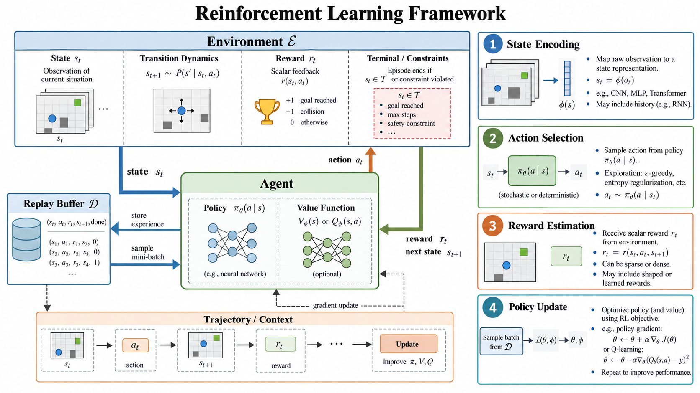

强化学习（Reinforcement Learning, RL）研究的是一类典型的<strong>序贯决策（Sequential Decision Making）</strong>问题。

与监督学习中“给定输入 $x$，预测标签 $y$”的学习范式不同，强化学习所关心的并不是一次孤立的预测，而是：

> **一个智能体应该如何在不断变化的环境中连续做出决策，使其在较长时间尺度上获得尽可能高的累计收益？**

强化学习中的每一次动作都会改变环境，而环境的变化又会进一步影响之后可以采取的动作与能够获得的奖励。因此，一个动作的好坏不能只根据当前一步的结果判断，而必须同时考虑它对**未来状态与未来收益**的影响。

本文从最基础的 Agent–Environment 交互过程开始，依次介绍 State、Action、Transition、Reward、Trajectory、Markov Property、MDP、Policy、Return、Value Function 与 Bellman Equation，并最终回答一个问题：

> **强化学习究竟在优化什么？**

*图：强化学习的整体交互框架。环境产生状态与奖励，智能体依据策略选择动作，并通过采样得到的轨迹不断更新 Policy 与 Value Function。*

---

## 1. 强化学习是什么？

强化学习系统中最基本的两个组成部分是：

- **Agent（智能体）**：负责观察环境并做出决策；
- **Environment（环境）**：接收智能体的动作，并返回新的状态与奖励。

例如，在一个迷宫任务中，控制角色移动的程序可以被视为 Agent，而迷宫本身构成 Environment。

在自动驾驶问题中，车辆的决策系统可以被视为 Agent，而道路、交通信号、其他车辆、行人与天气条件等共同组成 Environment。

在时间步 $t$，强化学习最基本的交互过程可以写成：

$$
S_t
\xrightarrow{\text{Agent}}
A_t
\xrightarrow{\text{Environment}}
(R_{t+1},S_{t+1})
$$

即：

1. Agent 观察当前状态 $S_t$；
2. 根据当前策略选择动作 $A_t$；
3. Environment 接收该动作；
4. Environment 转移到下一状态 $S_{t+1}$；
5. 同时返回奖励 $R_{t+1}$。

这一过程持续发生：

$$
S_0
\rightarrow A_0
\rightarrow R_1,S_1
\rightarrow A_1
\rightarrow R_2,S_2
\rightarrow \cdots
$$

Agent 正是在这种不断与环境交互的过程中逐渐学习：

> **在什么状态下采取什么动作，能够带来更高的长期收益。**

因此，强化学习与其说是一种“预测方法”，不如说是一种**通过交互学习决策策略的方法**。

---

## 2. 强化学习中的交互过程

理解强化学习，首先需要理解一次 Agent–Environment 交互中涉及的几个基本对象：

$$
\text{State}
\rightarrow
\text{Action}
\rightarrow
\text{Transition}
\rightarrow
\text{Reward}
$$

随着交互不断进行，这些状态、动作和奖励会进一步构成 Trajectory 与 Episode。

### 2.1 State：状态

状态（State）通常记为：

$$
S_t \in \mathcal S
$$

其中 $\mathcal S$ 表示**状态空间（State Space）**。

State 描述的是 Agent 在时间步 $t$ 做出决策时所依据的环境信息。

例如，在二维迷宫中，一个最简单的状态可以表示为：

$$
S_t=(x_t,y_t)
$$

其中 $x_t,y_t$ 分别表示 Agent 当前所在的位置。

在自动驾驶中，状态可能更加复杂：

$$
S_t=
(v_t,p_t,l_t,o_t,\ldots)
$$

其中可能包含车辆速度、位置、车道信息、周围车辆状态以及交通信号等。

因此 State 并不一定只是一个离散编号。它可以是：

- 一个整数；
- 一个坐标；
- 一个向量；
- 一个矩阵；
- 一张图像；
- 甚至是由神经网络编码得到的高维表示。

从更严格的角度看，State 最重要的作用并不是单纯地描述“现在发生了什么”，而是尽可能保留**对未来决策有用的信息**。

---

### 2.2 Action：动作

动作（Action）表示 Agent 在当前状态下能够采取的决策：

$$
A_t \in \mathcal A
$$

其中 $\mathcal A$ 表示**动作空间（Action Space）**。

在迷宫任务中：

$$
\mathcal A=
\{
\text{Up},
\text{Down},
\text{Left},
\text{Right}
\}
$$

这种动作数量有限的情况称为**离散动作空间（Discrete Action Space）**。

而在机器人控制中，一个动作可能表示多个关节的控制力矩：

$$
A_t=(\tau_1,\tau_2,\ldots,\tau_n)
$$

其中每个 $\tau_i$ 都能够在某个连续区间中取值，这类问题属于**连续动作空间（Continuous Action Space）**。

动作空间的性质会直接影响算法设计。例如：

- DQN 主要针对离散动作空间；
- DDPG、TD3、SAC 等算法可以处理连续动作空间；
- PPO 则能够根据策略分布的设计处理不同类型的动作空间。

---

### 2.3 Transition：状态转移

Agent 执行动作后，Environment 会根据当前状态和动作产生新的状态，这一过程称为**状态转移（State Transition）**。

通常使用：

$$
P(s'|s,a)
$$

表示状态转移概率，即：

$$
P(s'|s,a)
=
P(S_{t+1}=s' \mid S_t=s,A_t=a)
$$

它描述的是：

> 在当前状态为 $s$，执行动作 $a$ 的条件下，下一时刻进入状态 $s'$ 的概率。

如果：

$$
S_{t+1}=f(S_t,A_t)
$$

即下一状态完全由当前状态与动作决定，那么环境具有**确定性转移（Deterministic Transition）**。

如果：

$$
S_{t+1}\sim P(\cdot|S_t,A_t)
$$

即在给定当前状态和动作之后，下一状态仍然具有随机性，则称为**随机性转移（Stochastic Transition）**。

现实世界中的许多问题本质上都具有随机性。即使智能体执行完全相同的动作，也可能因为其他参与者、传感器噪声或环境扰动进入不同的下一状态。

---

### 2.4 Reward：奖励

Environment 除了返回下一状态外，通常还会返回一个标量反馈：

$$
R_{t+1}
$$

这就是**Reward（奖励）**。

Reward 用于表达：

> **刚才发生的状态转移，在当前任务目标下究竟有多好。**

例如，在迷宫任务中可以设计：

| 行为 | Reward |
| --- | ---: |
| 到达目标点 | +100 |
| 撞到障碍物 | -10 |
| 普通移动一步 | -1 |

为什么普通移动一步也可以设置成 $-1$？

因为如果移动完全没有成本，Agent 可能没有动力寻找更短的路径。加入每步惩罚后，为了获得更高的累计收益，Agent 会倾向于用更少的步数完成任务。

因此 Reward 不只是“给 Agent 一个分数”，它实际上还承担着**定义优化目标**的作用。

一个强化学习算法最终学到什么行为，很大程度上取决于 Reward 如何设计。

---

### 2.5 Trajectory：轨迹

随着 Agent 与 Environment 持续交互，会产生一个完整的序列：

$$
S_0,A_0,R_1,S_1,A_1,R_2,S_2,\ldots
$$

通常记为：

$$
\tau=
(S_0,A_0,R_1,S_1,A_1,R_2,\ldots)
$$

其中 $\tau$ 被称为**Trajectory（轨迹）**，也常被称为 rollout。

Trajectory 描述了 Agent 在一段时间内经历的完整状态、动作和奖励序列。

许多现代强化学习算法的训练过程都可以概括为：

$$
\text{Policy}
\rightarrow
\text{Environment Interaction}
\rightarrow
\text{Trajectory}
\rightarrow
\text{Policy / Value Update}
$$

也就是说，Agent 先使用当前 Policy 与环境交互，收集经验，再利用这些经验更新 Policy 或 Value Function。

---

### 2.6 Episode 与 Terminal State

如果一个任务存在明确的开始与结束，那么从开始到结束的一条完整 Trajectory 通常称为一个**Episode（回合）**。

例如：

$$
S_0
\rightarrow
S_1
\rightarrow
\cdots
\rightarrow
S_T
$$

其中 $S_T$ 表示任务结束时的状态，称为**Terminal State（终止状态）**。

典型的 episodic task 包括：

- 一局国际象棋；
- 一局 Atari 游戏；
- 一次迷宫寻路；
- 一次机械臂抓取任务。

---

## 3. Markov Property：马尔可夫性质

在强化学习中，一个很自然的问题是：

> Agent 到底需要知道多少历史信息，才能正确预测未来并完成当前决策？

假设 Agent 已经经历：

$$
S_0,A_0,S_1,A_1,\ldots,S_t
$$

那么在预测下一状态 $S_{t+1}$ 时，是否需要把完整历史都考虑进去？

如果每次决策都需要保存从任务开始到现在的全部信息，随着时间增长，问题会变得越来越复杂。

因此强化学习中一个非常核心的假设是**Markov Property（马尔可夫性质）**。

### 3.1 什么是 Markov State？

如果一个状态满足：

$$
P(S_{t+1}\mid S_t,A_t,S_{t-1},A_{t-1},\ldots)
=
P(S_{t+1}\mid S_t,A_t)
$$

那么称该状态具有 Markov Property。

也就是说：

> 在已经知道当前状态 $S_t$ 和当前动作 $A_t$ 的条件下，过去的信息不会再为下一状态提供额外信息。

换句话说，一个理想的 Markov State 应该满足：

> **当前状态已经包含了对未来预测与决策所需要的全部有效历史信息。**

例如，在一个简化的棋类环境中，如果当前棋盘状态已经完整描述了所有与后续合法动作有关的信息，那么预测下一状态时就无需重新查看整盘棋之前所有的落子历史。

Markov Property 的意义在于，它把一个可能依赖完整历史的问题压缩成了：

$$
S_t
\rightarrow
A_t
\rightarrow
S_{t+1}
$$

这样的局部状态转移问题。

这正是 MDP 能够成立的理论基础。

---

## 4. Markov Decision Process：马尔可夫决策过程

如果一个序贯决策问题满足 Markov Property，那么通常可以使用 <strong>Markov Decision Process（MDP，马尔可夫决策过程）</strong>进行建模。

一个经典 MDP 可以表示为五元组：

$$
\boxed{
\mathcal M=
(\mathcal S,\mathcal A,P,R,\gamma)
}
$$

其中：

- $\mathcal S$：State Space，状态空间；
- $\mathcal A$：Action Space，动作空间；
- $P$：Transition Probability，状态转移概率；
- $R$：Reward Function，奖励函数；
- $\gamma$：Discount Factor，折扣因子。

### 4.1 State Space

$$
\mathcal S
$$

表示所有可能状态构成的集合。

### 4.2 Action Space

$$
\mathcal A
$$

表示 Agent 能够采取的所有动作。

### 4.3 Transition Probability

$$
P(s'|s,a)
$$

描述在状态 $s$ 执行动作 $a$ 后进入状态 $s'$ 的概率。

### 4.4 Reward Function

Reward Function 可以根据具体建模方式写成：

$$
R(s,a)
$$

或者：

$$
R(s,a,s')
$$

其本质都是描述一次状态—动作—状态转移能够带来怎样的即时反馈。

### 4.5 Discount Factor

$$
\gamma\in[0,1]
$$

控制智能体对未来奖励的重视程度。

因此，一个 MDP 实际上给出了一个强化学习任务的数学描述：

> Agent 在状态空间 $\mathcal S$ 中根据某种决策方式选择 $\mathcal A$ 中的动作，Environment 根据 $P$ 产生新的状态，根据 $R$ 给出即时反馈，而 Agent 希望在 $\gamma$ 所定义的时间尺度上最大化长期累计收益。

---

## 5. Policy：策略

知道 State 和 Action 后，下一个问题就是：

> **Agent 根据什么决定当前应该执行哪个 Action？**

这个决定 Agent 行为方式的对象就是 **Policy（策略）**，通常记为：

$$
\pi
$$

### 5.1 Deterministic Policy

对于确定性策略：

$$
a=\pi(s)
$$

意味着：

> 给定状态 $s$，Policy 会直接返回一个确定的动作 $a$。

例如：

$$
\pi(s_1)=a_2
$$

表示 Agent 每次处于 $s_1$ 时都会选择 $a_2$。

---

### 5.2 Stochastic Policy

随机策略通常写为：

$$
\pi(a|s)
$$

表示：

$$
P(A_t=a|S_t=s)
$$

即：

> 在状态 $s$ 下选择动作 $a$ 的概率。

例如：

$$
\pi(\cdot|s)
=
[0.1,0.2,0.6,0.1]
$$

如果四个位置对应 Up、Down、Left、Right，那么 Agent 在这个状态中选择四个动作的概率分别为 $10\%$、$20\%$、$60\%$ 与 $10\%$。

在现代深度强化学习中，Policy 往往通过神经网络表示：

$$
\pi_\theta(a|s)
$$

其中 $\theta$ 为神经网络参数。

于是强化学习中的一个核心任务就可以转化为：

> 不断更新参数 $\theta$，使 $\pi_\theta$ 所产生的行为获得更高的长期收益。

---

## 6. Reward 与 Return

Reward 与 Return 是强化学习中非常容易混淆的两个概念。

Reward：

$$
R_{t+1}
$$

只描述**单个时间步上的即时反馈**。

而强化学习真正关心的通常不是单步 Reward，而是从当前时刻开始能够获得的**长期累计收益**。

### 6.1 为什么不能只最大化即时 Reward？

假设当前有两个动作。

Action A 会立刻得到：

$$
+10
$$

但之后进入一个很差的状态，几乎无法再获得奖励。

Action B 当前只得到：

$$
0
$$

但之后会进入一个很好的状态，并持续得到：

$$
+5,+5,+5,\ldots
$$

如果 Agent 只最大化当前一步 Reward，那么它会选择 Action A。

但如果考虑长期收益，Action B 很可能才是更加合理的决策。

因此我们需要引入 **Return（回报）**。

---

### 6.2 Return

最直接的 Return 可以写成：

$$
G_t=
R_{t+1}
+
R_{t+2}
+
R_{t+3}
+\cdots
$$

其中 $G_t$ 表示：

> 从时间步 $t$ 开始，Agent 在未来获得的累计 Reward。

实际强化学习中更常见的是 **Discounted Return**：

$$
\boxed{
G_t=
\sum_{k=0}^{\infty}
\gamma^kR_{t+k+1}
}
$$

即：

$$
G_t
=
R_{t+1}
+
\gamma R_{t+2}
+
\gamma^2R_{t+3}
+\cdots
$$

其中：

$$
\gamma\in[0,1]
$$

称为 **Discount Factor（折扣因子）**。

当：

$$
\gamma\approx0
$$

时，Agent 更加关注近期收益。

当：

$$
\gamma\approx1
$$

时，Agent 更加重视长期收益。

因此可以将 $\gamma$ 理解成控制 Agent **时间视野（time horizon）** 的参数之一。

---

## 7. Value Function：价值函数

Return 能够评价一段真实发生的未来轨迹，但 Agent 在做当前决策时，并不知道未来究竟会发生什么。

因此我们希望提前估计：

> **如果现在位于这个状态，未来大概能够获得多少 Return？**

这就产生了 **Value Function（价值函数）**。

---

### 7.1 State-Value Function

在策略 $\pi$ 下，一个状态 $s$ 的价值定义为：

$$
\boxed{
V^\pi(s)
=
\mathbb E_\pi
[
G_t
\mid
S_t=s
]
}
$$

它表示：

> 当前位于状态 $s$，并且之后按照 Policy $\pi$ 行动时，未来 Return 的期望值。

这里之所以出现数学期望 $\mathbb E$，是因为：

- Policy 可能具有随机性；
- Environment Transition 也可能具有随机性。

因此即使每次从同一个 State 出发，最终得到的 Return 也可能不同。

所以：

$$
V^\pi(s)
$$

可以理解成：

> **在策略 $\pi$ 下，状态 $s$ 到底有多好？**

---

### 7.2 Action-Value Function

只知道状态的价值仍然不够，因为 Agent 最终需要解决的是：

> **在状态 $s$ 中到底应该选择哪个动作？**

因此定义 **Action-Value Function（动作价值函数）**：

$$
\boxed{
Q^\pi(s,a)
=
\mathbb E_\pi
[
G_t
\mid
S_t=s,A_t=a
]
}
$$

它表示：

> 当前位于状态 $s$，首先采取动作 $a$，之后按照策略 $\pi$ 行动时，未来累计 Return 的期望。

因此：

$$
Q^\pi(s,a)
$$

回答的是：

> **在这个 State 下选择这个 Action，长期来看究竟有多好？**

这也是 **Q-learning** 中 “Q” 的来源。

---

### 7.3 V(s) 与 Q(s,a) 的关系

对于一个给定的 Policy：

$$
V^\pi(s)
=
\sum_a
\pi(a|s)Q^\pi(s,a)
$$

其含义是：

> 一个状态的价值，就是该状态下所有可能 Action 的价值，按照 Policy 的动作概率进行加权后的平均值。

如果已经获得最优 Action-Value Function：

$$
Q^*(s,a)
$$

那么最优状态价值为：

$$
V^*(s)
=
\max_aQ^*(s,a)
$$

相应地，最优动作可以写成：

$$
a^*
=
\arg\max_aQ^*(s,a)
$$

这正是很多 **Value-Based Reinforcement Learning** 方法的核心思想：

> 只要能够准确估计每个 State–Action Pair 的长期价值，就能够通过比较这些价值选择更好的动作。

---

## 8. Bellman Equation

Value Function 解决了“一个状态或动作长期有多好”的问题，但随之而来的另一个问题是：

> **这个长期价值应该如何计算？**

Bellman Equation 给出了强化学习中最重要的递归结构之一。

### 8.1 Return 的递归结构

从 Return 出发：

$$
G_t
=
R_{t+1}
+
\gamma R_{t+2}
+
\gamma^2R_{t+3}
+\cdots
$$

将后面的部分提取出来：

$$
G_t
=
R_{t+1}
+
\gamma
(
R_{t+2}
+
\gamma R_{t+3}
+\cdots
)
$$

而括号中的部分就是 $G_{t+1}$，因此：

$$
\boxed{
G_t
=
R_{t+1}
+
\gamma G_{t+1}
}
$$

这意味着一个长期累计收益可以递归地拆分为：

> **当前一步的 Reward + 下一时刻开始的未来 Return。**

---

### 8.2 Bellman Expectation Equation

对于 State-Value Function：

$$
V^\pi(s)
=
\mathbb E_\pi
[
G_t
\mid
S_t=s
]
$$

代入 Return 的递归形式，可以得到：

$$
V^\pi(s)
=
\mathbb E_\pi
[
R_{t+1}
+
\gamma V^\pi(S_{t+1})
\mid
S_t=s
]
$$

这就是 **Bellman Expectation Equation**。

它最核心的思想可以概括成：

$$
\boxed{
\text{Current Value}
=
\text{Immediate Reward}
+
\gamma\times
\text{Future Value}
}
$$

也就是：

> **当前价值 = 即时奖励 + 折扣后的未来价值。**

Bellman Equation 的意义在于，它把一个看似需要考虑整个未来的问题，转化成了：

> 当前一步 + 下一状态价值

这样的递归问题。

这正是 Dynamic Programming、Q-learning、DQN 与大量 Actor–Critic 方法能够建立起来的重要理论基础。

---

### 8.3 从 Bellman Equation 到 Q-learning

经典 Q-learning 的更新规则为：

$$
Q(s_t,a_t)
\leftarrow
Q(s_t,a_t)
+
\alpha
\left[
R_{t+1}
+
\gamma
\max_aQ(s_{t+1},a)
-
Q(s_t,a_t)
\right]
$$

其中：

$$
R_{t+1}
+
\gamma
\max_aQ(s_{t+1},a)
$$

正是在利用：

$$
\text{Immediate Reward}
+
\text{Future Value}
$$

构造当前 $Q(s_t,a_t)$ 的学习目标。

因此 Bellman Equation 并不是一个孤立的理论公式，而是后续大量强化学习算法的直接基础。

---

## 9. 强化学习的最终目标

到这里，已经可以完整地描述一个强化学习问题。

首先，Environment 可以用一个 MDP 表示：

$$
\mathcal M=
(\mathcal S,\mathcal A,P,R,\gamma)
$$

在时间步 $t$，Agent 观察：

$$
S_t
$$

并根据 Policy：

$$
\pi(A_t|S_t)
$$

选择：

$$
A_t
$$

Environment 再根据：

$$
P(S_{t+1}|S_t,A_t)
$$

产生下一状态，同时返回：

$$
R_{t+1}
$$

整个过程形成 Trajectory：

$$
\tau=
(S_0,A_0,R_1,S_1,A_1,R_2,\ldots)
$$

Agent 最终希望最大化的不是某一个 Reward，而是：

$$
G_0=
\sum_{t=0}^{\infty}
\gamma^tR_{t+1}
$$

因此强化学习的目标可以写成：

$$
\boxed{
\pi^*
=
\arg\max_\pi
\mathbb E_{\tau\sim\pi}
\left[
\sum_{t=0}^{\infty}
\gamma^tR_{t+1}
\right]
}
$$

其中：

$$
\pi^*
$$

表示 **Optimal Policy（最优策略）**。

从数学上看，强化学习最终做的事情就是：

> **在给定 MDP 中寻找一个 Policy，使该 Policy 所产生的 Trajectory 能够获得最大的期望累计折扣回报。**

---

## 10. 额外基础概念

### 10.1 Exploration vs Exploitation

强化学习中存在一个非常经典的问题：

**Exploration–Exploitation Trade-off**

即探索与利用之间的权衡。

假设 Agent 当前估计：

$$
Q(s,a_1)=10
$$

$$
Q(s,a_2)=8
$$

如果根据当前已有知识直接选择 $a_1$，就是 **Exploitation（利用）**。

但 $a_2$ 的价值较低，也可能只是因为 Agent 对它尝试得不够多。

因此 Agent 还需要偶尔选择当前看来并不是最优的动作，以获取新的信息，这就是 **Exploration（探索）**。

经典方法之一是 $\epsilon$-greedy：

$$
A_t=
\begin{cases}
\text{Random Action}, & \text{with probability }\epsilon\\
\arg\max_aQ(S_t,a), & \text{with probability }1-\epsilon
\end{cases}
$$

如果 Agent 只进行 Exploitation，它可能过早陷入一个次优策略；如果始终进行 Exploration，又无法真正利用已经获得的知识。

因此二者之间的平衡是强化学习中长期存在的核心问题之一。

---

### 10.2 Model-Based vs Model-Free

强化学习还经常被分成：

- **Model-Based Reinforcement Learning**
- **Model-Free Reinforcement Learning**

这里的 Model 指的是 **Environment Model**，例如：

$$
P(s'|s,a)
$$

用于描述环境如何发生状态转移。

如果 Agent 已知或能够学习环境模型，就可以提前预测：

> 如果我执行这个 Action，未来可能发生什么？

于是它可以在真正行动之前进行 Planning。

这类方法称为 **Model-Based RL**。

其基本思路可以表示为：

$$
\text{Learn / Know Model}
\rightarrow
\text{Predict Future}
\rightarrow
\text{Plan}
\rightarrow
\text{Act}
$$

而 **Model-Free RL** 不显式学习完整的环境转移模型，而是直接学习：

$$
V(s),\quad Q(s,a),\quad \text{or}\quad \pi(a|s)
$$

例如 Q-learning、DQN、PPO、SAC 等都属于典型的 Model-Free 方法。

最直观地说：

> **Model-Based RL 更关注“世界如何运行”，Model-Free RL 更直接地学习“应该怎么做”。**

---

### 10.3 Episodic vs Continuing

根据任务是否存在明确结束状态，强化学习还可以分为两类。

**Episodic Task** 存在明确的任务开始和结束：

$$
S_0
\rightarrow
S_1
\rightarrow
\cdots
\rightarrow
S_T
$$

例如一局游戏、一次迷宫寻路或者一次机器人抓取。

而 **Continuing Task** 理论上可以无限持续，没有明确 Terminal State，例如：

- 长期服务器资源调度；
- 数据中心能耗控制；
- 持续运行的机器人控制；
- 某些长期推荐系统。

在 Continuing Task 中：

$$
t\rightarrow\infty
$$

因此 Discount Factor 往往更加重要，因为当 $\gamma<1$ 时，折扣能够在适当条件下使无限时间范围内的 Return 保持有限。

---

## 11. 将所有概念串起来

如果把前面所有概念放到同一个强化学习过程中，可以得到如下逻辑。

一个强化学习任务首先由 MDP 描述：

$$
\mathcal M=
(\mathcal S,\mathcal A,P,R,\gamma)
$$

Agent 在当前 State：

$$
S_t
$$

下，根据 Policy：

$$
\pi(A_t|S_t)
$$

选择 Action：

$$
A_t
$$

Environment 根据：

$$
P(S_{t+1}|S_t,A_t)
$$

产生下一状态 $S_{t+1}$，同时给出 Reward $R_{t+1}$。

持续交互后得到：

$$
\tau=
(S_0,A_0,R_1,S_1,A_1,R_2,\ldots)
$$

为了评价长期收益，定义 Return：

$$
G_t=
\sum_{k=0}^{\infty}
\gamma^kR_{t+k+1}
$$

为了评价一个 State 的长期价值，定义：

$$
V^\pi(s)
=
\mathbb E_\pi[G_t|S_t=s]
$$

为了评价某个 State 下某个 Action 的长期价值，定义：

$$
Q^\pi(s,a)
=
\mathbb E_\pi[G_t|S_t=s,A_t=a]
$$

而 Bellman Equation 告诉我们：

$$
\text{Current Value}
=
\text{Immediate Reward}
+
\text{Discounted Future Value}
$$

最终，我们希望找到：

$$
\pi^*
=
\arg\max_\pi
\mathbb E_\pi[G_0]
$$

因此整套强化学习基础理论可以沿着这样一条逻辑链理解：

$$
\boxed{
\text{State}
\rightarrow
\text{Action}
\rightarrow
\text{Transition}
\rightarrow
\text{Reward}
\rightarrow
\text{Return}
\rightarrow
\text{Value}
\rightarrow
\text{Policy Optimization}
}
$$

State 回答“**现在在哪里**”，Action 回答“**现在能做什么**”，Transition 描述“**做了之后环境如何变化**”，Reward 描述“**环境如何评价这一步**”，Return 描述“**整个未来过程最终有多好**”，Value Function 则尝试在真正经历完整未来之前估计这一长期价值。

而 Policy 最终负责回答：

> **面对当前状态，我应该采取什么行动？**

强化学习算法所做的，本质上就是不断利用与 Environment 的交互数据改善这个答案。

---

## 12. 小结

如果只保留强化学习中最核心的一组基础概念，可以记住：

$$
\boxed{
State
\rightarrow
Action
\rightarrow
Reward
\rightarrow
Transition
\rightarrow
MDP
\rightarrow
Policy
\rightarrow
Return
\rightarrow
V/Q
\rightarrow
Bellman
}
$$

其中，MDP 负责对问题本身进行形式化描述；Policy 描述 Agent 如何决策；Return 定义长期收益；Value Function 则用来评价状态或动作的长期价值；Bellman Equation 将长期价值拆解成“即时奖励 + 未来价值”，从而建立了从基础理论通向具体强化学习算法的桥梁。

后续无论学习 Q-learning、DQN、Policy Gradient、Actor–Critic、PPO 还是 SAC，实际上都可以在这些基础概念中找到它们各自的位置。
