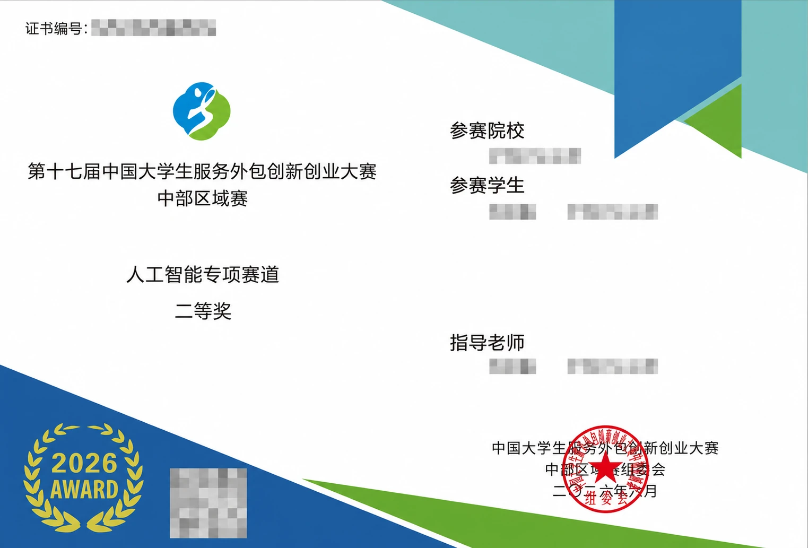

# 关于我对 AI 发展的一些看法

作为这个 Blog 的开山之作，我想先聊一个在我心中存在了很久的问题。

或者说，这是我学习计算机以来始终没有完全消失的一种矛盾：

> **AI 的发展，究竟会对我造成多大的影响？**

这个问题听起来有些宏大，但对我来说，它其实非常具体。

它关系到我现在正在学习的东西，关系到未来要从事什么样的工作，也关系到一个更直接的问题：

**如果 AI 能做的事情越来越多，那么我现在所学习的一切，还有多少价值？**

---

## 焦虑

2025 年到 2026 年间，我越来越明显地感受到大语言模型正在进入现实世界。

新闻里时常能看到公司裁员、组织调整以及利用 AI 提升效率的消息；在技术社区里，也经常能够看到类似：

> “完全没学过计算机，靠 AI 独立开发了一个应用。”

这样的内容。

其中，前端开发尤其经常被拿出来讨论。

原因也很容易理解。

对于今天的大语言模型来说，生成一个网页、修改 CSS、编写一个 React 组件，甚至根据需求搭建一个完整的 Web 项目，都已经不是什么特别困难的事情。

而对于当时的我来说，这些声音带来的并不是兴奋，反而是一种很强烈的焦虑。

因为我发现：

**AI 写出来的一些代码，甚至比我自己写得更好。**

它知道的框架比我多，阅读文档比我快，可以在极短的时间里生成大量代码，也不会因为连续工作几个小时而感到疲惫。

于是一个问题自然出现了：

> 如果一家公司的目标是尽可能提高效率，那么它为什么要选择我，而不是选择 AI？

这个问题我想过很多次。

甚至一度让我觉得，继续去卷那些 AI 已经非常擅长的事情，似乎是一件没有意义的事。

如果 AI 的代码写得比我快，那我要不要比它写得更快？

如果 AI 知道的知识比我多，那我要不要试图记住更多知识？

如果 AI 可以一天生成几万行代码，那我是不是也应该不断提高自己的代码产量？

后来我慢慢觉得：

**这种竞争本身可能就是错误的。**

人没有必要在 AI 最擅长的地方，和 AI 比谁更像 AI。

与其一边焦虑，一边试图在 AI 的优势领域和它竞争，不如换一个角度：

> 能不能利用 AI 带来的能力扩张，让自己去完成以前无法完成的事情？

这个想法真正发生变化，是在 2026 年 3 月。

---

## 第一次真正尝到 AI 的甜头

2026 年 3 月，我参加了一次与智能体决策相关的比赛。

在报名参加比赛之前，我对于 PPO 几乎一无所知。

不是“不熟悉”，而是真正意义上的：

**0 基础中的 0 基础。**

如果按照以前的学习方式，我可能首先需要去搜索 PPO 是什么，然后找课程、看论文、看教程，再一点点理解强化学习、策略梯度、Actor-Critic 等前置知识。

光是搭建整个知识框架，就可能需要很长时间。

但这一次，我大量使用了 Codex、ChatGPT，以及社区里其他参赛者和前辈分享的经验。

我可以随时问：

- PPO 为什么需要裁剪？
- Advantage 到底是什么？
- Actor 和 Critic 分别在做什么？
- 为什么训练出来的策略会突然崩掉？
- 这个 reward 设计是不是存在问题？
- 这段代码为什么会导致训练不稳定？

以前很多需要在搜索引擎、论文、博客和代码仓库之间来回寻找的信息，现在可以通过 AI 很快获得一个大致方向。

它当然不一定总是正确。

但它可以快速帮助我建立一个初步的知识框架。

而当这个框架建立起来以后，我再去阅读论文、代码以及其他人的经验时，理解成本会低很多。

最终，我也算在比赛里取得了一些成果。



现在回头看，如果完全没有 AI 的帮助，我很难想象自己能够在一两个月的时间里，从几乎不了解 PPO，到真正搭建训练流程、不断调整策略，并且完成整个比赛。

也是从这件事情开始，我第一次真正意义上尝到了 AI 带来的“甜头”。

我开始意识到：

> **也许我在某些事情上确实不如 AI，但这并不意味着 AI 是我的竞争对手。**

它同样可以成为我的工具。

过去，我可能因为知识不足而无法开始一个项目。

现在，我至少可以借助 AI 快速理解其中的基本概念，然后边做边学。

过去，一个超出我能力范围的问题可能意味着：

> “这个我不会。”

而现在，它更可能意味着：

> “这个我现在不会，但我可以先让 AI 帮我找到进入这个问题的路径。”

这两句话看起来很像，但它们背后的差别其实非常大。

---

## AI 扩大了我的能力边界

2026 年这一年里，我陆续使用过 Qwen、DeepSeek、ChatGPT、Claude、豆包等不同的大语言模型。

使用得越多，我反而越不觉得 AI 是一个“全知全能”的存在。

相反，我开始逐渐认识到：

**AI 很强，但这种强是有边界的。**

而理解这些边界，可能和学习如何使用 AI 本身同样重要。

其中让我感受最明显的，第一个问题就是幻觉。

---

## AI 会非常自信地犯错

所谓 AI 幻觉，简单来说就是：

**模型给出了看起来非常合理的回答，但内容实际上并不正确。**

有时候它会答非所问。

有时候会顺着用户的话不断认同。

有时候会编造不存在的信息、来源、事实甚至细节。

真正危险的地方并不是它会犯错。

人当然也会犯错。

问题在于：

> **AI 有时候会用一种非常确定、非常完整、非常有逻辑的方式犯错。**

如果用户本身没有相关知识，又没有仔细检查，很容易把一个错误答案当成事实。

这件事情我自己就吃过一次很深刻的亏。

---

## 我曾经被 ChatGPT “骗”得很彻底

有一次临近期末考试，我正在做一份往年的期末试卷。

但我手里只有题目，没有答案。

当时我的想法非常简单：

> 这种题对于 ChatGPT 来说应该是小 case 吧？

再加上那门课当时我只学习了一两天，自己的知识储备非常有限，因此面对 ChatGPT 给出的答案，我几乎没有能力进行判断。

于是我选择了相信。

而且不是一般的相信。

是：

**深信不疑。**

后来，我偶然在贴吧里找到了那一年的参考答案。

对照之后，我才发现事情有点不对劲。

ChatGPT 给出的部分答案并不是存在一些小误差，而是从思路到结果都存在问题。

而在此之前，我竟然完全没有意识到。

这件事情对我的影响其实很大。

因为它让我第一次真正意识到：

> **AI 的回答看起来像答案，不代表它就是答案。**

一个表达流畅、逻辑完整、甚至带有公式和推导过程的回答，同样可能是错的。

从那之后，我开始对 AI 的输出保持一种更加谨慎的态度。

尤其是在自己完全不了解的领域。

因为这是一个很有意思的悖论：

**你越不懂一个东西，就越需要 AI；但你越不懂一个东西，也越没有能力判断 AI 是否在胡说。**

这可能才是目前使用 AI 最大的问题之一。

---

## 所以，“什么都不用学，只靠 AI”并不现实

也正因为如此，我越来越不认同一种说法：

> “以后什么都不用学，会用 AI 就够了。”

至少以我现在的体验来看，这件事情完全没有这么简单。

因为使用 AI 本身也是有门槛的。

你需要知道：

什么答案可能有问题。

什么代码看起来能运行，但实际上埋着隐患。

什么地方需要验证。

什么地方不能相信。

什么问题应该继续追问。

什么时候应该去查官方文档。

什么时候应该自己动手实验。

而这些判断能力从哪里来？

最终还是来自：

> **你自己的知识。**

假设 AI 给我生成了一段代码。

如果我完全不知道这段代码在做什么，那么即使它现在能够运行，我也很难判断：

它有没有安全问题？

有没有性能问题？

为什么这里要这样写？

以后需求变化了应该改哪里？

报错之后应该怎么办？

AI 可以帮我生成答案。

但它不能替我拥有判断力。

所以我现在越来越觉得：

> **AI 降低的是“做事情”的门槛，而不是“理解事情”的价值。**

甚至某种程度上，AI 越强，判断能力反而越重要。

---

## 第二个问题：上下文并不是无限的

除了幻觉之外，我目前感受很明显的另一个限制，就是上下文。

所谓上下文窗口，可以简单理解为：

> **AI 在一次任务中能够同时“看见”和处理的信息范围。**

现在的大语言模型，相比早期已经能够处理非常长的上下文。

但“上下文很大”和“模型真正理解了全部信息”，并不是同一件事情。

这一点在长对话和大型代码项目中尤其明显。

比如我们和 AI 持续讨论一个问题几十轮之后，有时候会发现：

它开始忘记前面已经确定好的要求。

或者重新提出已经解决的问题。

甚至前后采用不同的设计方案。

处理大型代码仓库的时候，这种感觉会更加明显。

一个真正的软件项目可能包含：

```text
前端
后端
数据库
配置
构建系统
CI/CD
测试
历史代码
依赖关系
业务规则
```

而这些东西之间又存在大量联系。

AI 即使能够读取很多文件，也不意味着它能够像长期维护这个项目的开发者一样，始终拥有完整、稳定的项目认知。

我在使用 AI 修改代码时已经慢慢养成一个习惯：

> **不要默认它还记得之前所有事情。**

重要的约束要重新说明。

重要的代码要自己检查。

大型修改之前要先让它理解结构。

修改之后还要运行测试。

因为 AI 的“记忆”并不等于人的长期理解。

---

## AI 可以生成代码，但不一定理解你的真正目标

还有一个我逐渐意识到的问题是：

很多时候，真正困难的并不是“把代码写出来”。

而是：

**到底应该写什么。**

假设需求是：

> 帮我写一个博客。

AI 很快就可以生成一个博客。

但是：

博客为什么存在？

你想记录什么？

首页应该展示什么？

什么东西不应该出现？

这个网站未来会不会扩展？

内容应该如何分类？

你希望它给别人什么感觉？

这些问题没有唯一正确答案。

至少目前，AI 很难替一个人决定：

> **你究竟想要什么。**

比如现在这个 Blog。

AI 可以帮助我写 Astro。

可以帮助我修改 CSS。

可以检查代码。

可以生成组件。

甚至这个 Blog 很多具体实现都可以借助 AI 完成。

但是：

为什么我要做这个 Blog？

我要在这里记录什么？

为什么我不希望它变成一个纯粹的项目展示网站？

为什么首页应该这样设计？

为什么有些功能我要删除？

这些东西最终还是需要我自己决定。

于是我逐渐开始觉得：

> **未来真正重要的能力，也许不是“比 AI 更快地产出”，而是知道什么值得产出。**

---

## 从“和 AI 竞争”到“利用 AI”

如果让我回头看一开始的焦虑，我觉得其中有一个很大的问题：

我默认把自己和 AI 放在了同一条赛道上。

我在想：

> AI 会不会比我写代码更快？

> AI 会不会知道得比我更多？

> AI 会不会替代我？

但现在，我觉得这可能并不是最有意义的问题。

就像计算器出现以后，人没有必要和计算器比赛谁算乘法更快。

搜索引擎出现以后，人也没有必要和搜索引擎比赛谁记住的网页更多。

工具的意义，本来就是放大人的能力。

所以现在我更愿意问的是：

> **如果 AI 可以帮助我显著提高效率，那么我应该用多出来的能力去做什么？**

比如以前需要一个月才能了解的领域，现在有没有可能一个星期建立基础认识？

以前因为不会前端而做不了的网站，现在能不能自己做出来？

以前因为看不懂论文而放弃的问题，现在能不能让 AI 先帮我拆解？

以前因为项目过于复杂而不敢开始的事情，现在能不能先做一个最小版本？

从这个角度来看，AI 对我来说最大的价值并不是：

> **帮我少学一些东西。**

反而可能是：

> **让我有能力学更多以前学不到的东西。**

这也是我目前最愿意接受的一种人与 AI 的关系。

---

## 我现在如何看待 AI

至少在今天，我不会选择完全拒绝 AI。

因为那相当于主动放弃一个极其强大的工具。

但我也不会选择完全依赖 AI。

因为我已经亲身体会过：

**把自己的判断力全部交给 AI，是一件非常危险的事情。**

所以现在，我更愿意把两者之间的关系理解成：

> **Use AI, but don't depend on AI.**

使用 AI。

但不要依赖 AI。

让它替我查找方向、解释概念、生成初稿、阅读代码、寻找问题、扩展思路。

但最终：

理解是不是正确的，

代码能不能合并，

信息是否可信，

方案是否合理，

应该做什么，

仍然需要我自己判断。

---

## 写在最后

AI 的发展速度可能还会继续超出我的预期。

几年之后再回头看今天的这些想法，其中有一些可能会显得非常幼稚。

也许今天看起来很困难的问题，到那个时候已经完全被解决。

也可能会出现现在的我完全无法想象的新问题。

所以这篇文章并不是想预测：

> AI 最终会发展成什么样。

因为我也不知道。

我只是想记录下，在 2026 年这个时间点，一个正在学习计算机的人面对 AI 时真实存在过的一些困惑。

我曾经焦虑过：

> 如果 AI 什么都会，那我学这些还有什么意义？

现在我的答案还不完整。

但至少我开始有了一个暂时的答案：

> **学习的目的，也许从来都不是证明自己比工具更强。**

计算器比我算得快。

搜索引擎知道的网页比我多。

大语言模型能够比我更快地生成代码和文字。

这些事情并不会让学习本身失去意义。

因为真正属于我的东西，是理解、判断、选择以及提出问题的能力。

AI 可以扩展我的能力边界。

但我仍然需要知道，自己想往哪里走。

所以，与其每天思考：

> **“AI 会不会取代我？”**

我现在更愿意问自己：

> **“有了 AI 之后，我能不能成为一个比以前更强的自己？”**

至少现阶段，我认为这个问题更加重要。
