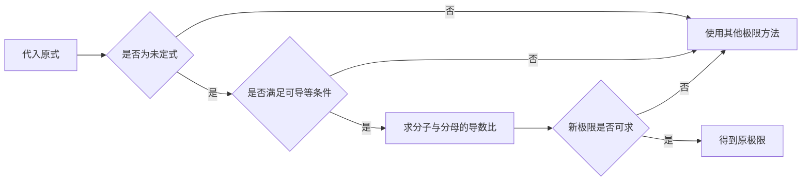

## 一句话理解

当未定式满足条件时，可以通过比较分子与分母导数的极限来研究原极限喵~

若函数 $f(x)$ 与 $g(x)$ 满足洛必达法则的条件，则可以考察下面的关系喵~

$$
\lim_{x \to a}\frac{f(x)}{g(x)}
=
\lim_{x \to a}\frac{f'(x)}{g'(x)}
$$

## 核心条件

- 原式必须先确认是适用的未定式喵~
- 分子与分母需要在相应邻域内可导喵~
- 分母导数在所研究的邻域内不能为零喵~

| 检查项   | 需要确认的内容         | 常见结果                |
| -------- | ---------------------- | ----------------------- |
| 未定式   | 代入后是否为 $0/0$     | 可以继续检查其他条件喵~ |
| 可导性   | 去心邻域内是否可导     | 不满足时不能直接使用喵~ |
| 导数极限 | 新极限是否存在或为无穷 | 存在时可得到原极限喵~   |

> [!WARNING]
>
> 洛必达法则处理的是满足条件的未定式，不能把“分式极限”直接等同于“分子分母分别求导”喵~

## 易错点

洛必达法则不是看到分式就求导，使用前必须检查未定式与适用条件喵~

## 计算示例

下面的 TypeScript 函数用离散采样直观展示 $\frac{\sin x}{x}$ 在零点附近的趋势喵~

```ts title="limit-sample.ts" {4-6}
const sampleLimit = (step: number) => {
  const samples: Array<{ x: number; value: number }> = [];

  for (let index = 3; index >= 1; index -= 1) {
    const x = step * index;
    samples.push({ x, value: Math.sin(x) / x });
  }

  return samples;
};
```

## 判断流程



## 学习场景


这张学习场景图片来自 [Sha Mala 的 Unsplash 作品](https://unsplash.com/photos/a-laptop-computer-sitting-on-top-of-a-wooden-desk-tpGlGc_Le4c) 喵~
